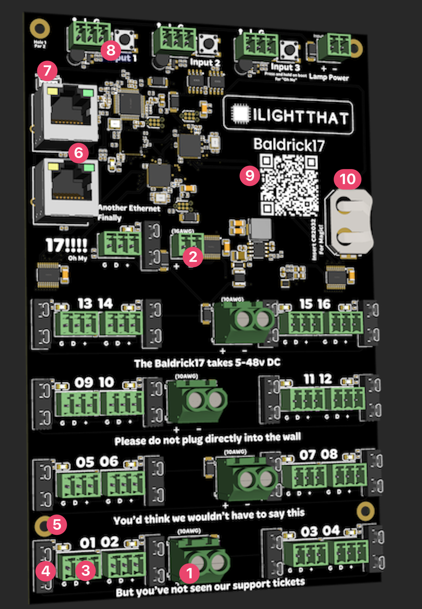

# Board Overview

1. 10AWG Power Jack, these can take 5v to 48v (each jack powes 4 pixel ports and can take different voltages and will automatically step down to power the components, no jumpers neede).
2. 16AWG Power Jack, A special connector for port 17, can take 5v to 48v. 
3. Pixel connectors, using the industry standard Phoenix connectors, your pigtails or extensions will be added in G (Ground) D (Data) + (Positive / Voltage)
4. Fuse Holder, Easy to access fuses for protection (and easy changing), the Baldrick17 is designed with 7.5amp mini blade fuses.
5. Mounting Holes, we've designed the Baldrick17 to fit snugly ontop of a meanwell power supply. These 3mm mounting holes are positioned for protection.  **DO NOT DRILL out** these holes to make them fit the screws you've got already, doing this will void any warranty. 
6. 2 Ethernet ports, I know I know, "you are really spoiling us". We've added two 100mb ethernet ports to connect to your show network and daisy change other things in the Baldrick Family.
7. Mind ya business
8. 3 Turniput connectors, The Baldrick17 goes beyond button inputs and adds lamp management to the easy interactivity (we also have physical buttons on the board for testing, pressing and holding these buttons will [activate test mode or reset the board](board_buttons))
9. QR Code, an easy to scan QR code which will take you to these docs for easy troubleshooting
10. CR2032 battery cradle, allows for RTC and CunningFX scheduling
