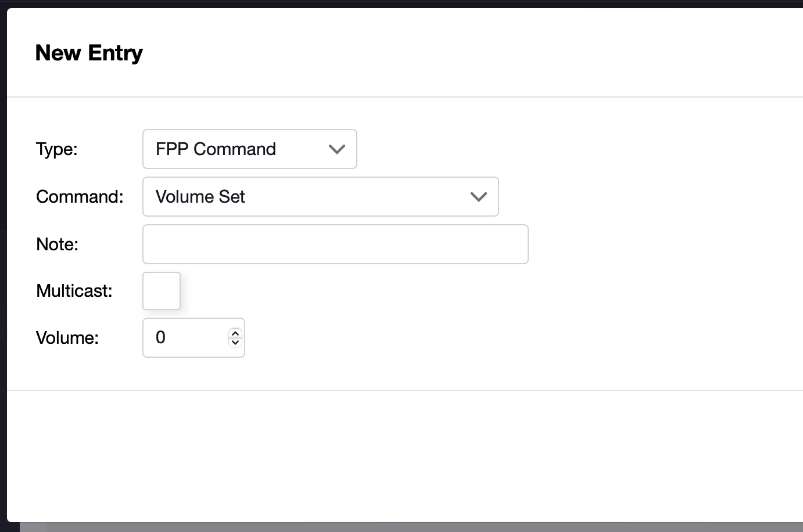

# How do FPP API Commands work?

FPP comes with a really useful API which lets us do things like play sequences, change the volume and more remotely.

Combining that API with the Baldrick button URL boxes is a simple way of adding interactive elements to your show.

The first thing we need is the IP Address of your FPP installation, in this case we are using **192.168.1.50** but please replace this when adding to your button config.

Commands are sent to the URL **/api/command/command name/options**


### Start the show
If you want to give someone a magical moment and be able to start the show by pressing a button, you must first get your show playlist name (in this case we are using **Show Time** as our playlist name but please replace it with yours)

You set your button command to go to 
```
e.g. http://192.168.1.50/api/command/Start Playlist/Show Time
```

This will start the playlist everytime someone presses the button, which is great.. until some little sh... visitor presses it again and again, to solve that we can use the **IfNotRunning** setting. 

Add **/false/true** to the end of that URL *(The false tells FPP not to repeat the playlist and the true tells it only to play if it isn't already playing)*

```
e.g. http://192.168.1.50/api/command/Start Playlist/Show Time/false/true
```

*Warning, if another playlist is playing whilst this button is pressed, it will interupt it*

### Sound on button
Lets say that you wanted to only play the sound on your show when someone presses a button and that continues till either the end of the song or playlist.

You set your button command to go to 
```
e.g. http://192.168.1.50/api/command/Volume Set/70
```

Then at the bottom of each playlist (or song in the playlist) you just add an entry for FPP command which sets the volume to 0


