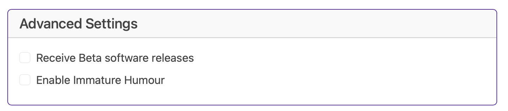

# Advanced Settings

We avoided it for so long but it's finally time to have a "box to stick stuff that doesn't fit in the other categories"  and here it is, Advanced Settings

## Receive Beta software releases

Sometimes features need a bit more testing before we are ready to push them out to the wider world, if you like living on the edge (or just like being nosey).

## Enable Immature Humour

Some of our vendors love the board but do NOT appreciate our humour and so asked to remove the childish brightness names and test modes, this setting let's those customers WHO BELIEVE IN FREEDOM turn them back on.

