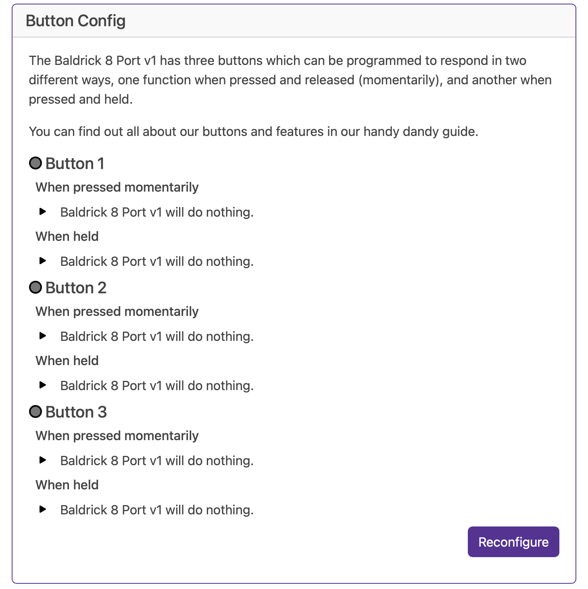
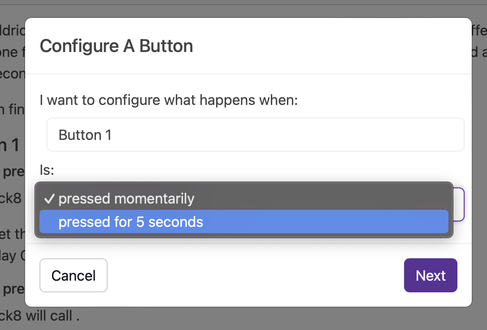
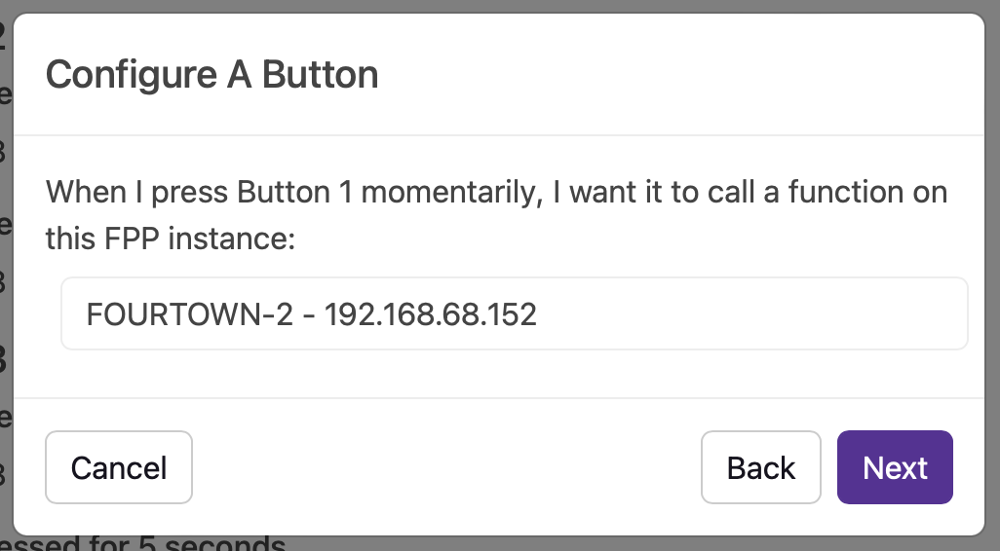
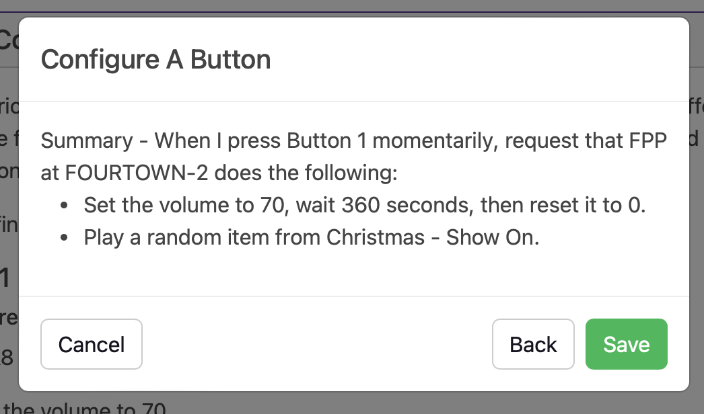
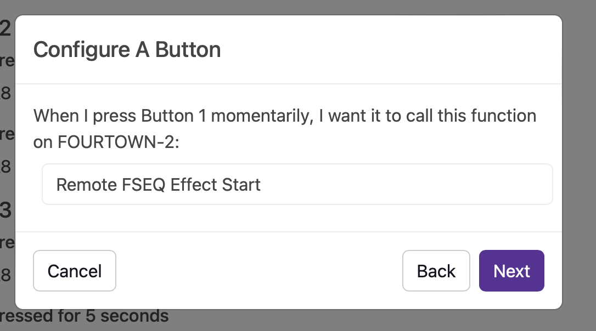
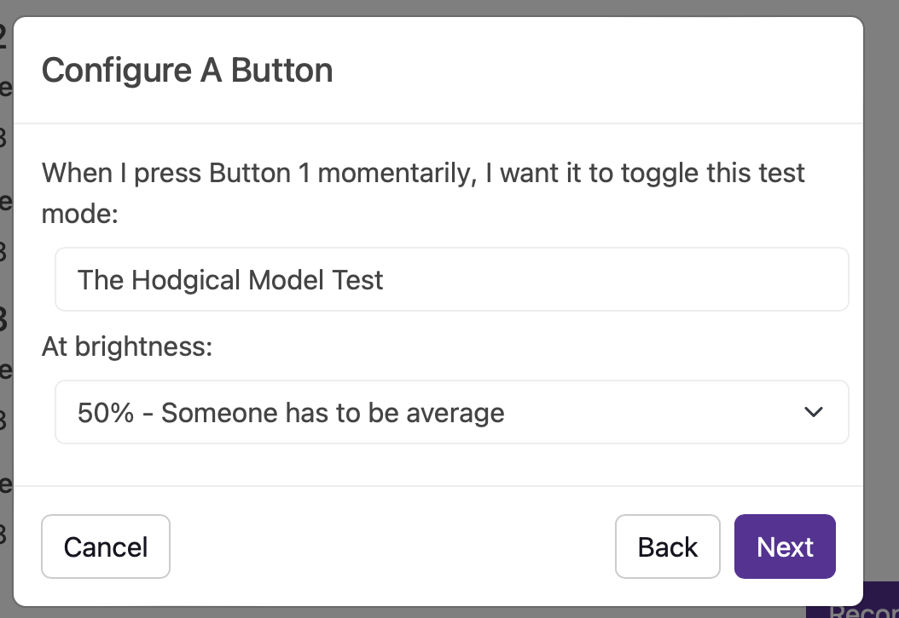
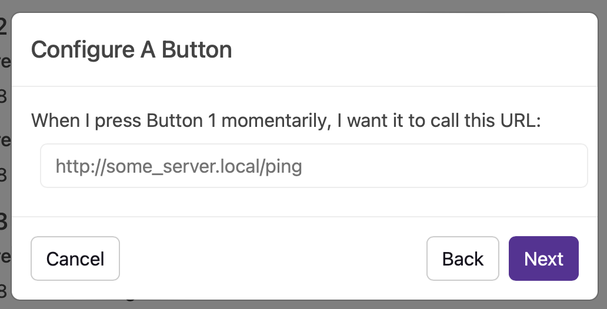
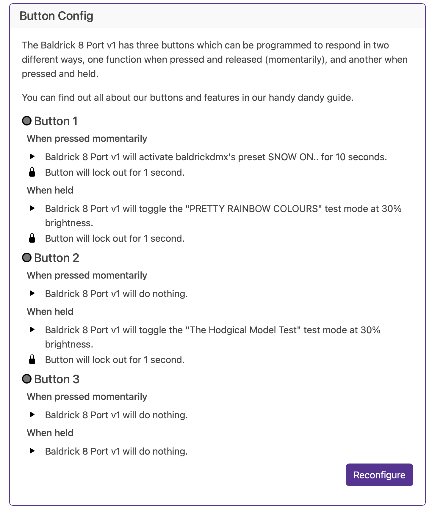

# Turniputs

The Baldrick17 comes with three turninputs to attach external triggers (buttons, beam breaks, motion sensors) that can be configured when triggered to do a multitude of tasks.

* FPP Integration
* Toggle a Baldrick Test Mode
* Change a BaldrickSwitchy output
* Change a BaldrickDMX Preset
* Call an HTTP URL
* Do Nothing

But that's not all, the Turniput allows you to manage a button LED (or lamp) and control the on, off, fade, breath effects to show the active stateus. 

Each input has two action states* either pressed instantly or held, when an input is in the active state, the interface will show the status by highlighting the LED

## What do those things actually mean

### FPP 

FPP (or Falcon Pi Player) is our recommended show player for the holiday lighting hobby, it has some really powerful functionality and is simple to setup and use, that power also extends to it's API which allows people to do some really cool stuff.. But we don't think you should have to learn the API to do that cool stuff

We've two ways of using FPP which which have proper names but let's call them 'Easy' (*Control an FPP Instance*) and 'Advanced' (*Call an FPP API Directly*)

Both start off the same way by selecting the FPP instance that you'd like to interact with

If we can't find it automatically you can put in an IP address (although it might be worth finding out why we can't find it as it will be pretty hard to send commands to something we cannot find)

Then we move to the fun stuff

#### Control an FPP Instance

This section takes away having to use the scary API to ask FPP to do some things, for our initial version you can change the volume of FPP (either forever or for a period of seconds) or play a song / playlist / random song from a playlist. 

Sorry did I say or I meant AND.. you can do both of these, with one input and we will even pull in live your sequences and playlists direct from FPP.

#### Call an FPP API Directly

If you want to get your hands dirty with FPP commands, here it is, almost everything you can do via the API direct and configurable to be executed via a Baldrick8 input! 

### Toggle a Baldrick Test Mode

Sometimes you just want to quickly test how the props look (or put something up when the neighbors pop round to 'see how it's going')

You can quickly enable any of our test modes at a specific brightness with the touch (or activation) of an input

### Change a BaldrickSwitchy output

Have you heard about BaldrickSwitchy? Do you want to turn on your bubble machine, snow machine, AC lights or anything else via xLights or a Baldrick Button.. 

From this section you can turn on (or off) a BaldrickSwitchy port for x number of seconds.

Much like FPP, we will automatically detect the board and whilst I'd love to have the screenshot of it here, at the time of writing this documentation my BaldrickSwitchy is in another building and it's far too hot to move from the sofa, did you know Britain is having a bit of a heatwave right now?? 

### Activate a BaldrickDMX preset

This function will activate a preset command on your BaldrickDMX, perfect for activating a snow machine, bubble machine or pointing a moving head at one specific spot.

### Call an HTTP URL

When we first launched the Baldrick8, we were so proud of this feature! Imagine being able to call a web API from a simple trigger! We even wrote a [Quick FPP API Guide](../common-questions/fpp_api_commands.md) to help someone start and stop sequences 

### Do Nothing

Sometimes you set a input to do something and think, oh actually no, that's not what I want, what I actually wanted was it to do nothing.

Now you can, you. are. welcome. 

## So finally

When that's all done, you might have a little something that looks like this

 . * Technically some have three as don't forget the physical buttons on the board, these will activate the functionality AND have [secret functionality](../board_buttons.md).