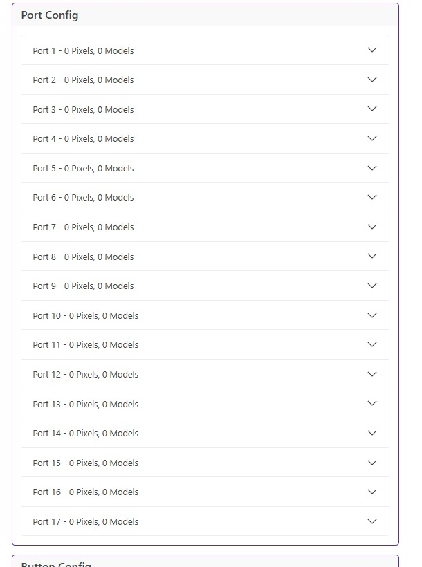

# Port Configuration

Let's be honest, most of the time you are going to be using xLights to play with your ports but if you want to be a strong independent person, you can drill down into each port, monitor and configure the models, the pixel count and brightness.