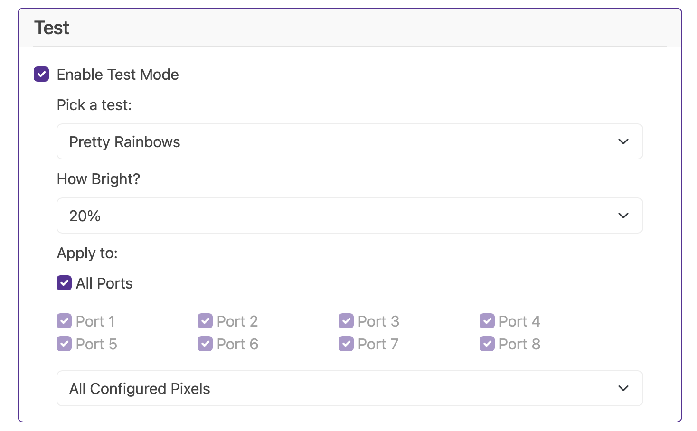
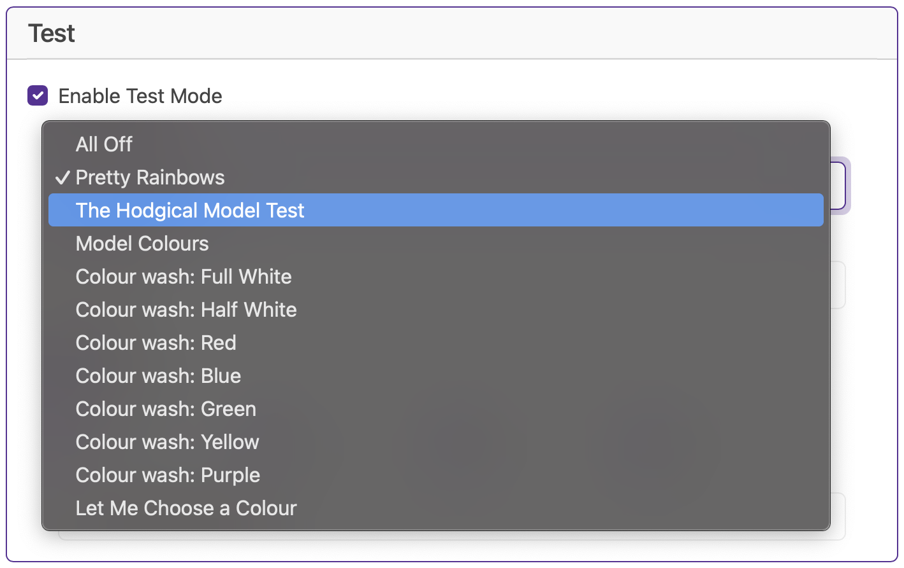
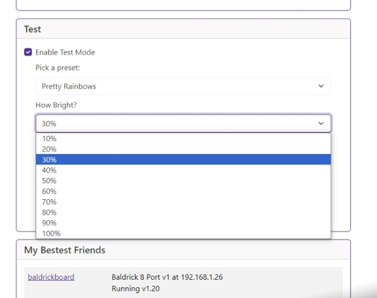
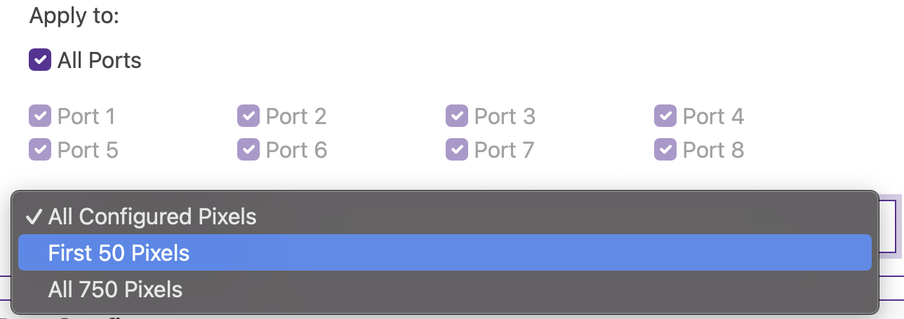

# Test Mode

Test mode is one of the most important features of the Baldrick Board, if it's two hours before switch on and something is going wrong, YOU NEED CLEAR INFORMATION QUICKLY..

Let's break these down 

### Colour Presets

We've created a bunch of presets to help you with your testing but we got bored with just writing colours so we thought we'd have some fun with the names.. you might want to have a look at something special we've introduced called [Hodgical Mode](../common-questions/hodgical-test-mode)

### Brightness

Sometimes 100% is too much *Have you done those power calculations correctly?* so we give you the choice of brightness. 

### Apply to

Select your port (or all ports) then select if you want ALL configured pixels, 750 pixels or 50 pixels.

## I thought there were naughty words in this board?

Some of our vendors think their customers are a bit sensitive soo  have asked us to put the fun stuff behind an option, if you go to [Advanced Settings ](advanced.md) you can *Enable Immature Humour*

