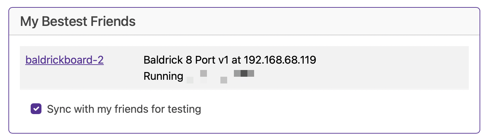

# Turnip Network

The Baldrick17 will keep an eye out on the network for other Baldricks and let you know how they are doing (this is helpful as we don't put an LCD screen on the board).

## Test Sync

Ticking this box will sync the test mode between all compatible boards, meaning if you are doing something on the house and want all your baldricks in Test Mode, it's very easy to do!

