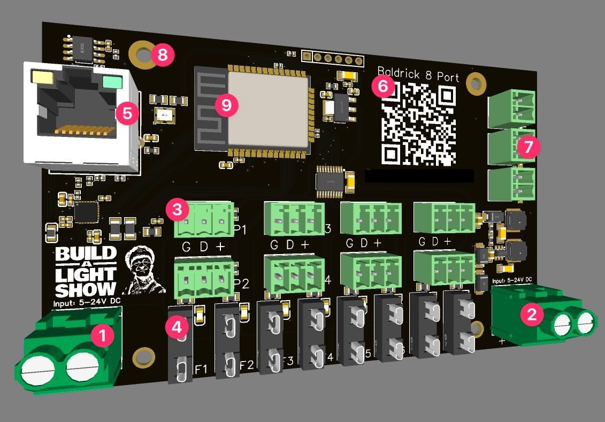

# Board Overview

1. Power Jack
2. Power Jack, Both 1 & 2 are power input jacks, these can take 5v to 24v (each side can take different voltages) and will automatically step down to power the components, no jumpers needed.
3. Pixel connectors, using the industry standard Phoenix connectors, your pigtails or extensions will be added in G (Ground) D (Data) + (Positive / Voltage)
4. Fuse Holder, Easy to access fuses for protection (and easy changing).
5. Ethernet port, To ensure the high FPS that this controller is designed for we've added a 100mb ethernet port to connect to your show network
6. QR Code, an easy to scan QR code which will take you to these docs for easy troubleshooting
7. Button connectors, The Baldrick8 can run three buttons which will execute URLS on press (we also have physical buttons on the board for testing, pressing and holding these buttons will [activate test mode or reset the board](board_buttons))
8. Mounting Holes, we've designed the Baldrick8 to not only be as compact as possible, we've matched the mounting holes to other common controllers so mounts can be reused (in this case the Falcon SRX2 Receiver). **DO NOT DRILL out** these holes to make them fit the screws you've got already, doing this will void any warranty. 