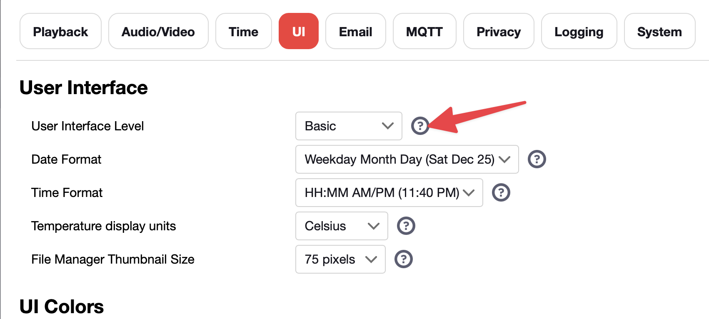
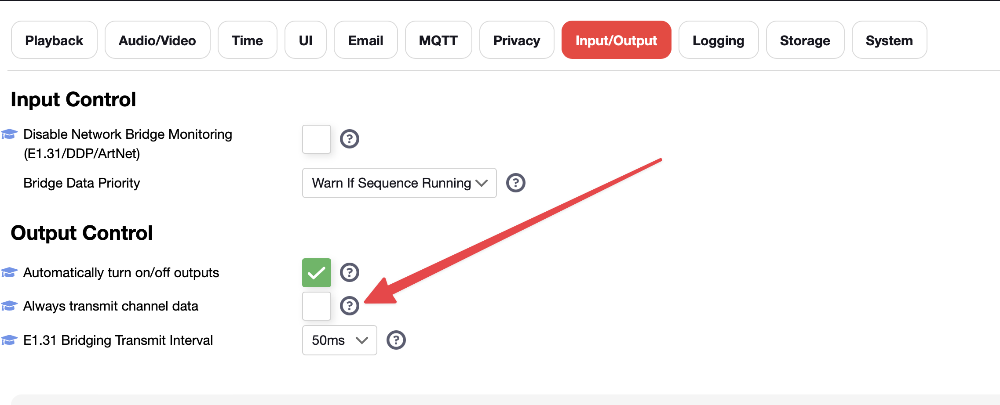

# GS8208 Pixels Data Issues

Some of batches of 4 wire pixels (double data) require a constant source of data, otherwise some genius thought it would be a great idea to have the default to a test mode on full 100% brightness..

The most common of these are GS8208 pixels.

You can set your Baldrick8 to the Paint it Black test mode which will stop that but its a pain in the arse to change everytime you stop your show. 

For those using FPP you can configure FPP to output channel data at all times.

Firstly you need to enable the Advanced UI by going to Settings > UI > Interface level and switching that to Advanced.

Then head to the Input / Output tab and tick the box which states
 "*Always Transmit Channel Data*"

This means FPP will keep outputting data to the pixels even if there isn't a sequence playing.

*As of writing we are currently in a seasonal feature freeze for the Baldrick family which means no new updates will be posted unless they are firmware breaking, however we will review how we can work on this on a controller level once this is over*

