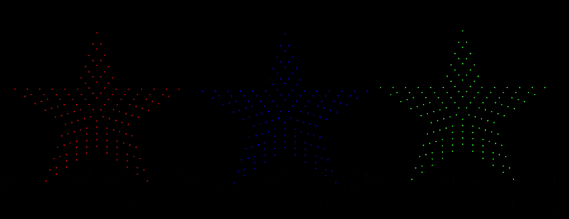

# What is Hodgical Mode

The Hodgical Test is a mode on the Baldrick8 which allows for easy debugging of pixel and model issues.

The Hodgical Test runs the RGB cycle on each model on a port but each subsequent model starts with the subsequent colour.

You can see here these three stars on the same port.

* Star 1 starts with RED, then goes GREEN then goes BLUE
* Star 2 starts with GREEN, then goes BLUE then goes RED
* Star 3 starts with BLUE, then goes RED then goes GREEN

*If we had a star four that would go RED then GREEN then BLUE*

## Why Hodgical Mode

This allows us to quickly  
* Check if pixels are failing on any specific colour value
* Confirm the models are set up correctly (is half of your snowflake the wrong colour)
* Put something up on the house when someone comes over and 'wants to see it working*

## No, I mean why did you call it Hodgical

Because it was an idea from Dom Hodgson (although obviously Pete did all the work) and so obvious his ego wouldn't let it be named something NORMAL..

## Why RGB, why not a colour wash?

A colour wash starting at different times on props can be overwhelming with colour and takes longer to debug issues (it also doesn't look as good as you might think)