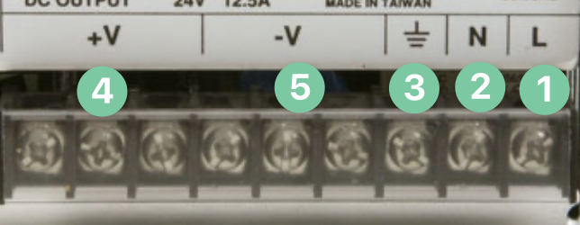
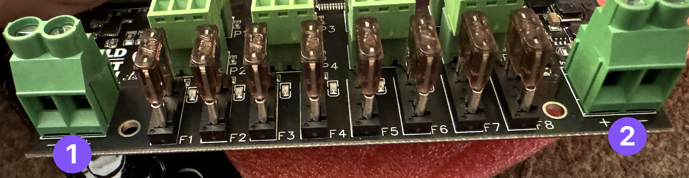

# Plugging in your controller
We start off with the exciting bit, plugging it in and making things (intentionally) flash.

## Always use a power supply 

Never, ever EVER EVER plug your controller directly into the wall outlet, it will go bang and you'll have to buy another one and explain to your partner what that burn mark on the kitchen table is. 

You'll notice that a British plug has three wires and our power jacks inputs only have two that's because you need to put a power supply in between them.

We recommend the use of [Meanwell Power Supplies](https://buildalightshow.com/search?controller=search&s=meanwell).

### The Power Supply Explained

1. **Live** - The live wire carries electricity from the power source to appliances or circuits, supplying the energy needed for operation. On a British plug this is generally BROWN.
2. **Neutral** - This carries the electricity back to the power source. On a British plug this is generally BLUE.
3. **Earth** - This grounds electrical systems, redirecting excess current safely into the ground to prevent shocks and fires. On a British plug this is generally GREEN / YELLOW.
4. **+V**, The positive voltage output of the power supply, typically you'd attach a RED cable to this.
5. **-V**, The negative voltage output of a power supply, typically you'd attach a BLACK cable to this.

### Powering the board

The Baldrick8 has two power inputs to help manage power distribution.

- Port 1 will power pixel ports 1 - 4
- Port 2 will power pixel ports 5 - 8
- Either port will automatically power the board, you do not need to configure this
- Both ports will handle between 5v to 24v and can be different voltages 

As with all power connectors, please check for stray strands BEFORE turning on your controller, those aren't the flashing lights we want to create.

### What cable do I use?

The thicker the cable the better (within limits), DO NOT use the wire your wall plug came with to link your power supply to your controller. 

It is almost certainly not thick enough to handle the amps. 

We recommend [10AWG](https://amzn.to/3uOmTz6) cable wire at a minimum but please do further research for your requirements.

