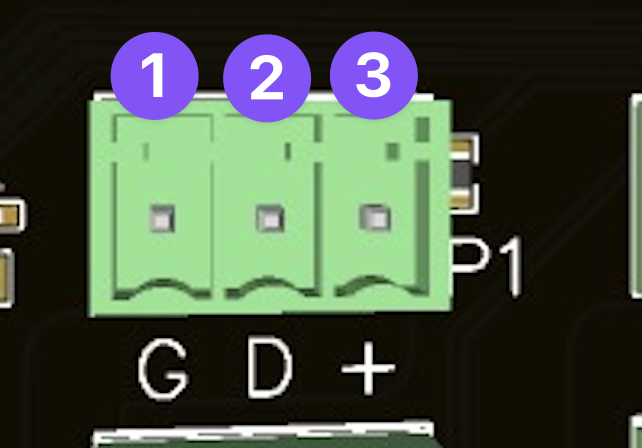

# Connecting Pixels
It's time to connect the lights.

## To pigtail or not to pigtail

We recommend adding [pigtails](https://buildalightshow.com/accessories-hardware/113-weatherproof-pigtails.html) to your controller rather than pixels directly.

Your controller will come with 3 port Phoenix connectors 

### The Phoenix Connector Explained

1. **GROUND** - The negative wire of your pixels (this is BLACK)
2. **DATA** - The data in wire of your pixels,  (this is YELLOW)
3. **LIVE** - The positive wire of your pixels (this is RED)

(The colour suggestions are for BALS pixels, if you are buying from somebody else... then ask them)
