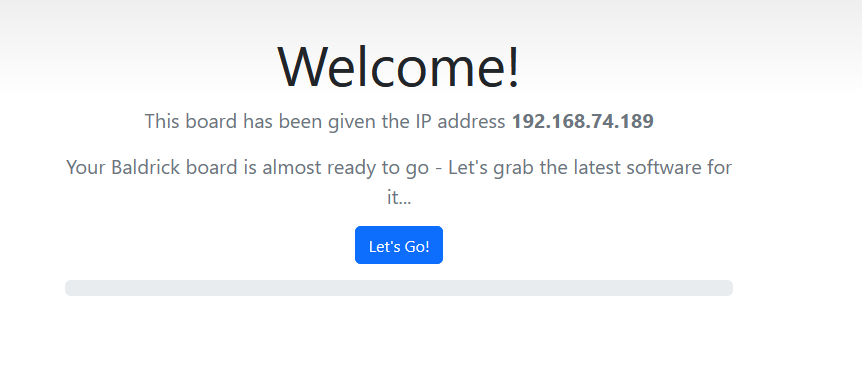

# Installing the firmware
When your controller arrives it will be in a 'sleeping state' you just need to plug it into your network and head to [http://baldrickboard.local](http://baldrickboard.local) (if your DNS doesn't accept that then just look for it on your network)

## How to install

To put it simply, press the button that says *Lets Go* then go and have a brew, the controller will connect to our server, download the latest firmware and automatically install it, once it's done the page will refresh and you can start connecting pixels.

### It's not working?

You must plug the board directly into your network for the initial firmware download (or make sure your computer can give it an IP address and internet access).

## How do I update after that?

when you go to the Web interface and look at the stats section, you'll see the version number, if there is a new version, you can click that and it will automatically update in a similar interface to how this initial install works
