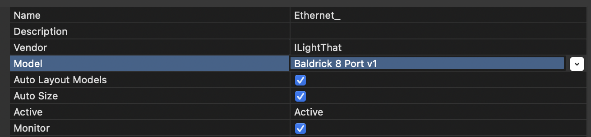

# xLights Connection
You can connect directly with xLights, look for Baldrick Controller under ilightthat

From here you can push your model settings directly to the controller and output to lights nice and easily! 

You can either;
* Click **Discover** and xLights will automagically find the Baldrick8.
* Add the board manually by selecting *ILightThat* as a vendor and *Baldrick 8 Port v1* as the Model. You will then need to put the IP Address in manually
