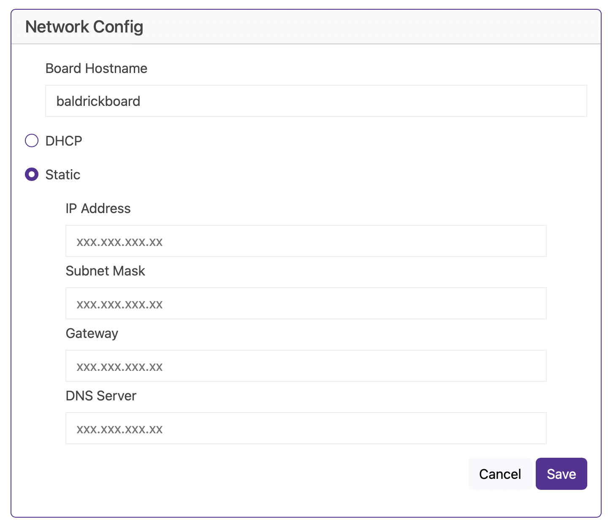

# Networking

## Good Defaults, Easy Config

- **Hostname** - The default hostname is baldrickboard (hence baldrickboard.local), if you have one Baldrick8 then it's completely fine to keep this as it is, however if like us you want to collect a few of them, then we'd recommend you change this to something like *frontgarden* or *upstairsroof* **(Just a reminder that hostnames should be lowercase without spaces)**

- **DHCP / STATIC** - The default option is DHCP (which is Dynamic Host Configuration Protocol but you don't need to know that) which basically means your router or computer gives the board an I.P. address, this is great for initial setup but when you want to run a show it's best to switch it to STATIC, that's where your controller tells the router / computer This is my IP. 

- **IP Address** - Set this to the IP address that you want the controller to be fixed to
- **Subnet Mast & Gateway** - It is more than likely that you can copy the Subnet Mask (the size of your network) and the Default Gateway (the exit point of your network) from the output of a [IPconfig check](../../common-questions/ipconfig_check).  
- **DNS Server** - DNS wise, typically, your your default gateway is your router IP, and that more often than not, can provide your network with DNS. However, some people like to use "outside 3rd parties" DNS like google or cloudflares DNS. If you don't know about this, its probably best just to stick to DHCP.

