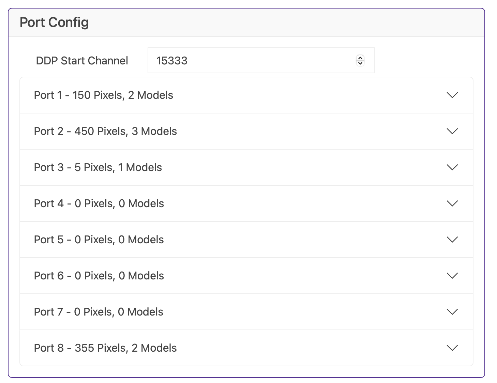

# Port Configuration

I'll be honest, the Baldrick8 is designed on the basis that 99% of the time you'll be pushing config directly from xLights to the board so you should *never* have to play with this section.

But if you do, you can drill down into each port, monitor and configure the models, the pixel count and brightness.