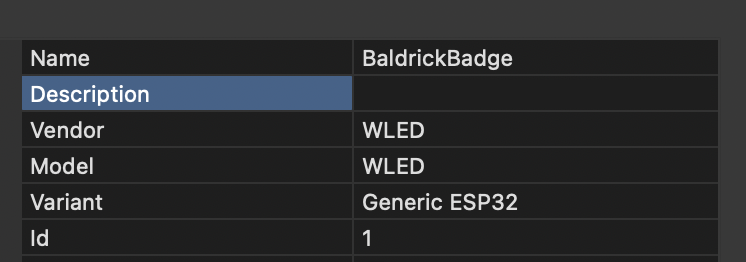

---
sidebar_position: 2
---

# xLights

You can connect the badge to xLights and use it as a controller, xLights discover won't work but if you get the IP address of it, you can use the following settings

Port 1 should be the onboard Pixels 
Port 2 should be the one built in
Ports 3, 4 and 5 should be the additional ones if you have the upgrade kit