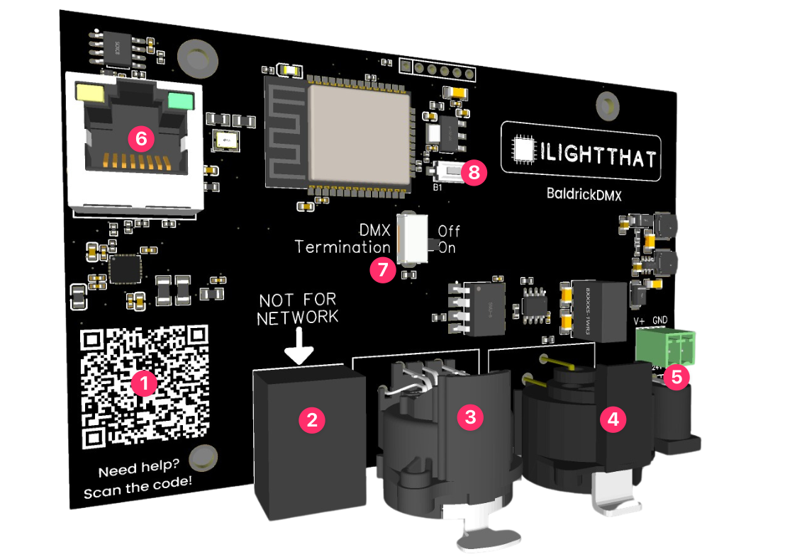

# BaldrickDMX Board Overview

1. QR Code, an easy to scan QR code which will take you to these docs for easy troubleshooting
2. DMX OUTPUT RJ45 - with a helpful reminder NOT TO PLUG THIS PORT THIS ON YOUR NETWORK
3. DMX OUTPUT 3 PIN - A fancy schmancy Neutrik XLR
4. DMX OUTPUT 5 PIN - A fancy schmancy Neutrik XLR
5. Power input - You've got the choice of a Phoenix connector or barrel jack (DO NOT USE BOTH), these can take 5v to 24v and will automatically step down to power the components, no jumpers needed.
6. Ethernet port, plug this into your show network
7. DMX Termination switch - DMX cables need to have their ends properly terminated to prevent any issues with the signal.  Sometimes, the cable plugs have this built-in, but if they don’t, this switch lets you do it right there. *On some boards this switch may be hard to shift due to the coating process, a quick push with a flat head screwdriver should move it easily, we've learned from this and will be revising this button placement in the next revision)*
8. Button, use this factory reset the board if you break it (press and hold on boot for 5 seconds)

Not marked.  Mounting Holes, we've designed the BaldrickDMX to not only be as compact as possible, we've matched the mounting holes to other Baldrick boards so mounts can be reused. **DO NOT DRILL out** these holes to make them fit the screws you've got already, doing this will void any warranty. 