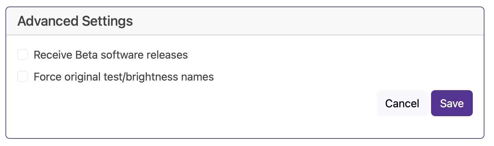

# Advanced Settings

We avoided it for so long but it's finally time to have a "box to stick stuff that doesn't fit in the other categories"  and here it is, Advanced Settings

## Launch preset at boot
This allows you to select a preset to be loaded by default when the board is loaded, if a signal is detected from the network then this preset is overridden.