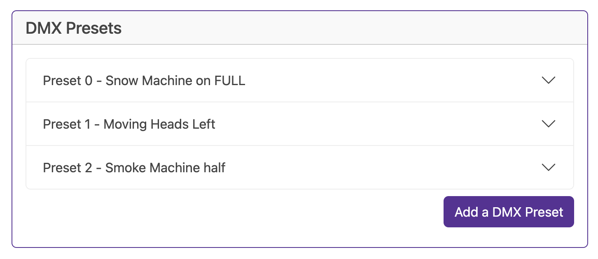
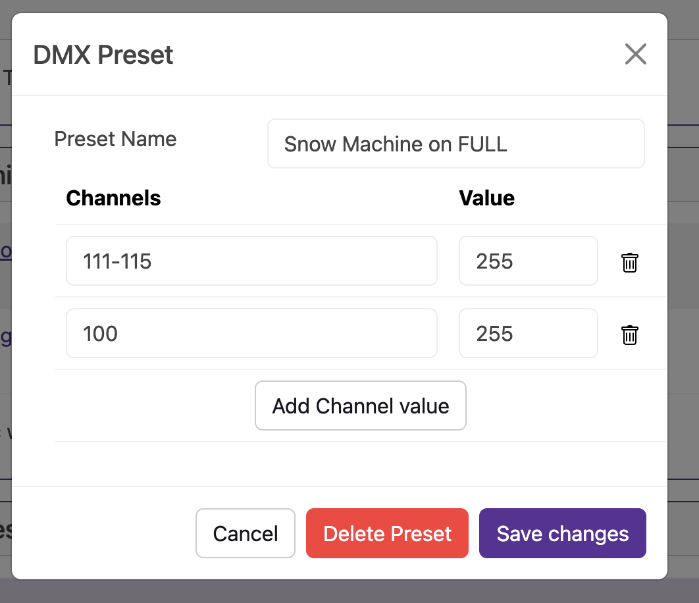

# Presets

The BaldrickDMX lets you define Presets of set channels and values that can be used either in a test mode or via an an action over the "turnip network"

## Add a preset

When you add a preset, you are asked for the channels and a value, you can add as many channels and values as you like.

The channels input takes comma separated values such as *11,16,19,21* but also can take ranges such as *100-150* this will include all the numbers between 100 and 150 (including 100 and 150)

### Mark mode

Coming soon

