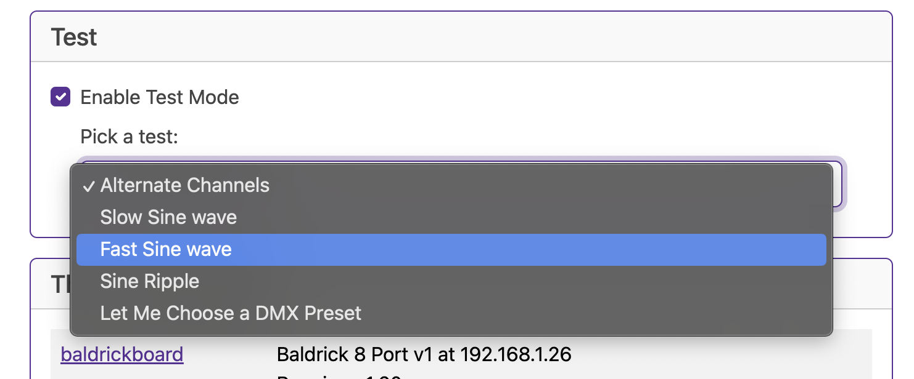

# Test Mode

Test Mode allows you to, well, test the board. 

Let's break these down 

### Alternate Channels

### Slow Sine Wave

All channels start at zero. They all go to 255, and all back to zero. If you graphed the value of any given channel over time, it would be a sine wave. 

It does this slowly.

### Fast Sine Wave

All channels start at zero. They all go to 255, and all back to zero. If you graphed the value of any given channel over time, it would be a sine wave. 

It does this faster.

### Sine Ripple

Plot channel numbers on x axis against values on y and you'll get a sine wave. That sine wave moves over time, so each channel moves between 0 and 255 and back.

It does this medium speed.

### DMX Preset

Allows you to select a DMX preset that you've created as a test mode
