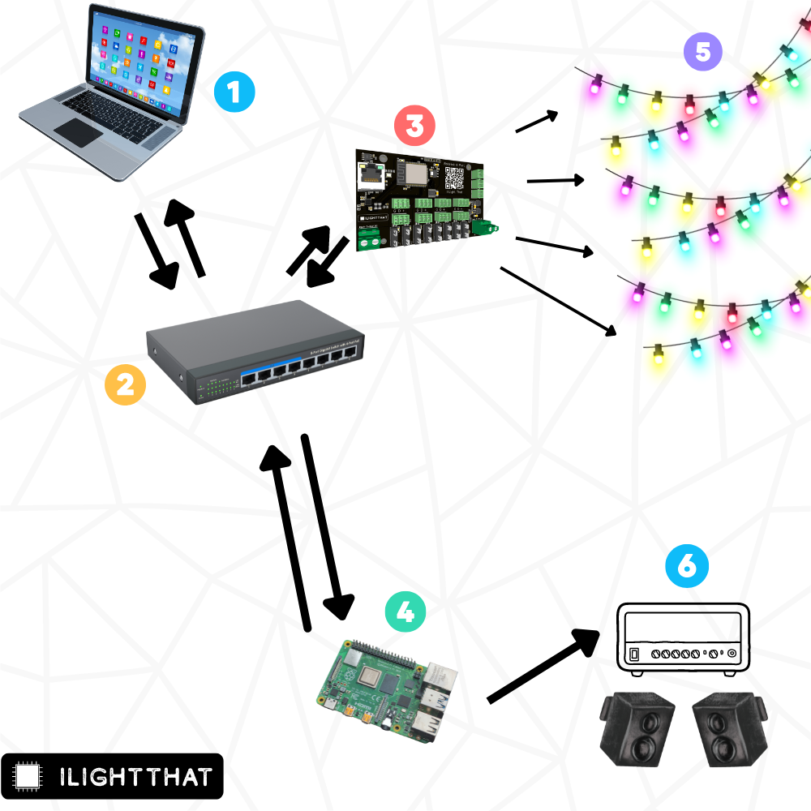

# 2. Hardware Basics

So you’ve decided to join our Christmas light hobby and have a light display on your house (or apartment, shed or car).

There can be a lot of hardware involved in this hobby, in this section we are going to discuss a typical setup and look at what each thing does and why it’s needed. 

This is probably NOT how yours will end up looking so don’t get too stressed if this looks overly complicated. 

1. **A Computer** 

If the controller is doing all the pixels and the player is telling the controller what to do then you shouldn’t need a fast laptop to do a light show right?

Well, it depends how complicated your light show is going to be, when you add thousands of lights with lots of effects that are a lot of maths (I can call it maths because this isn’t an american document) that your computer has to do and some if is pretty complicated! So doing this on a Time Machine might not be your best option

On and xLights works on Mac and PC but we’d recommend either a dual monitor or large monitor setup for sequencing! 

2. **A Switch** 

This will let you add a showplayer and one or more controllers to the display easily (we can do it without via something called *Proxying* but we won't be covering that in this guide because I'd rather eat gravel)

3. **A Controller** 

At the heart of every light show is a controller, something to tell the lights to turn on and off. There are lots to choose from and so it all comes down to a) what your plans for the show are and b) what budget you have.

OBVIOUSLY we are talking about a Baldrick8 in this guide, other controllers are available but you aren't reading their manual.

4. **A ShowPlayer** - 

The player is hardware + software which will automatically play the show according to either a schedule, manual command or button press.

Here we have a Pi running FPP listed but you could use an old laptop running xSchedule or something similar, the key is that it should be something that during show time is dedicated to that task.

5. **Pixels**

There are four common types of pixel that you’ll see discussed on the group

* Bullet 
* Seed
* Square
* Strip

These pixels typically come in three voltages 5v, 12v & 24v, there is always a debate over which ones are better but it’s not a debate, 12v is better. 

Whilst 5v is cheaper per pixel it requires additional spend, on distribution boards, cable and also the invaluable commodity - time. 

As with everything, they all have their pros and cons. 

6. **Audio Outputs** 

If you are using a sequence with a sound-track, you will also need a way to play the music to your audience.

For those using a Pi as their Show Player many find that a usb sound card gives better quality output compared to the on board audio jack.

To output your sound you can either use an amplifier with speakers or a transmitter to output the audio via an unused FM radio channel so your audience can tune in and hear the music.

Avoid using Bluetooth transmitters as the audio delay varies and you will not be able to sync it to your light show.

*IMPORTANT: At time of writing, in the United Kingdom the only legal FM transmitters that do not require a licence are CE approved low powered units designed for in-car use. These are meant to have a range of only a few metres, but many people find they will actually go further and have enough range for their shows. In the UK if you use a more powerful transmitters you will be breaking the law unless you obtain a Short-term restricted service licence to broadcast, details are at Ofcom *