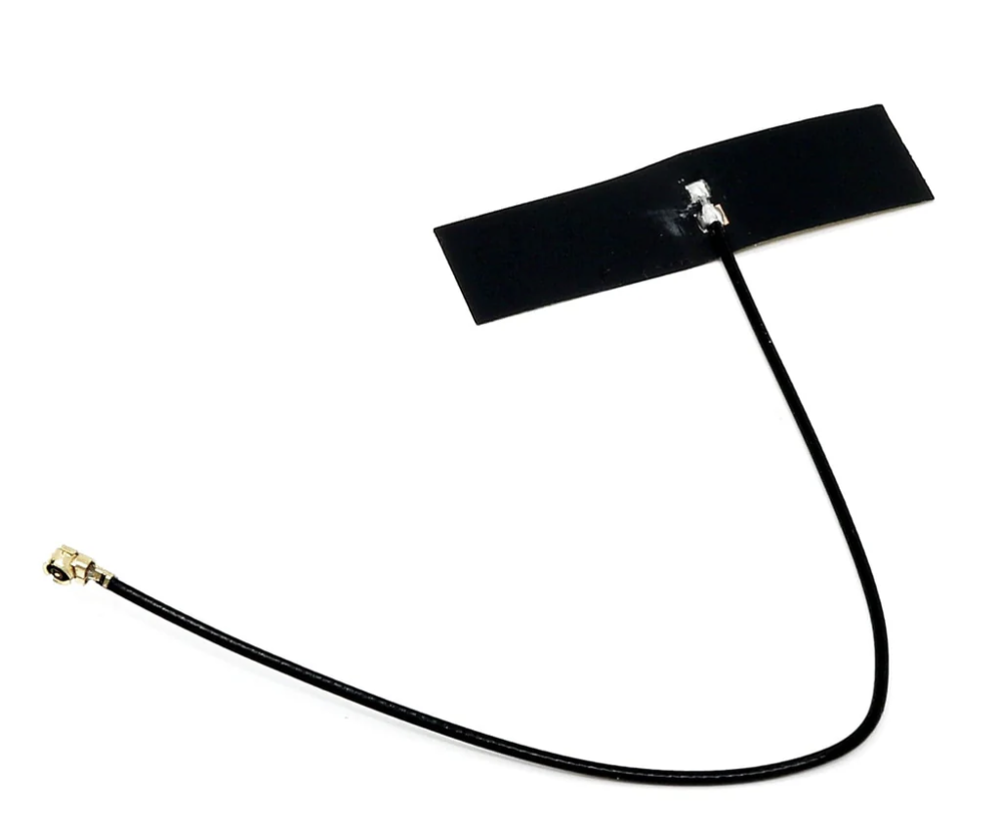

# Antennas?

Some of our boards  (**[BaldrickInput1](input1/introduction)** &  **[BaldrickSignals](signals/introduction)**) require an antenna to work.

Typically we supply a 3dBI antenna which (depending on surrounding environment) will have a range of up to 10-15m.

Your vendor may stock larger antenna or you could use amazon / Aliexpress.

The connection on our wireless chip has many names **uFL/u.FL/IPX/IPEX-1**, these will all fit. 
