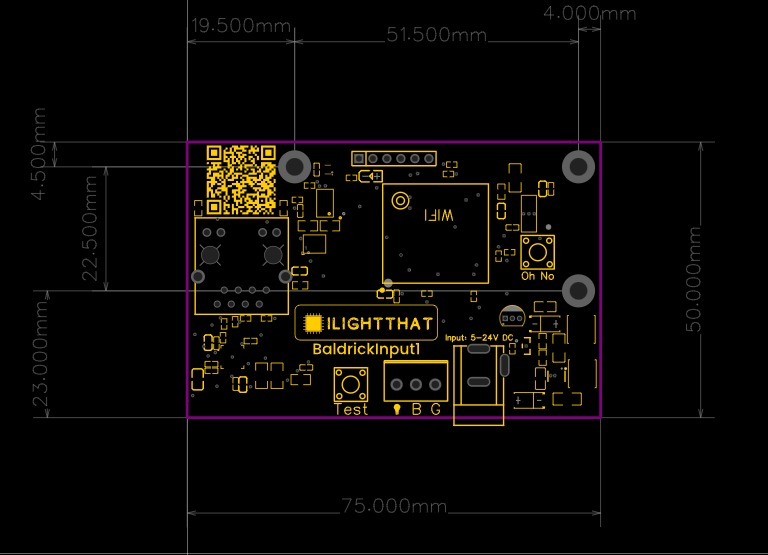
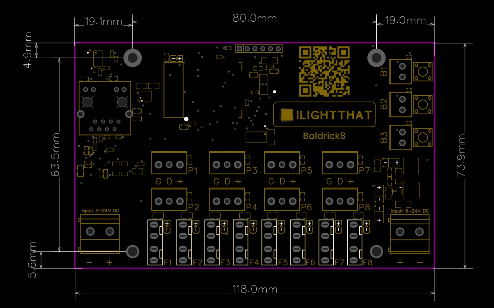

# Baldrick Dimensions

Baldrick Boards are categorised into two board sizes *small* and *medium*, this means that we don't have to keep making new mounts and accessory sizes as we create new boards.

Mounting holes in all our boards are *M3*

## Small
We've designed the Small so it can be hidden inside a small junction or project box.

## Medium
We based the dimensions of the *Medium Baldrick boards* to match similar boards already in the market so you can reuse mounts and 3D printed elements.

The Baldrick community have created an amazing range of mounts and STLs that you can print and use today.

The board footprint is just 117mm by 74mm.

Once again we ask **DO NOT ENLARGE THE MOUNTING HOLES**