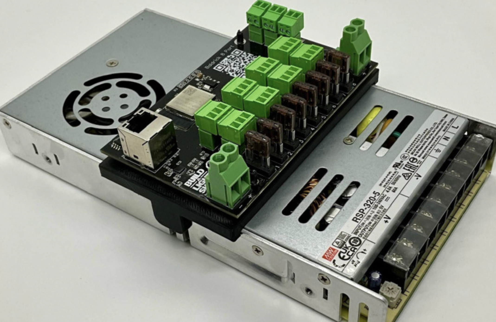
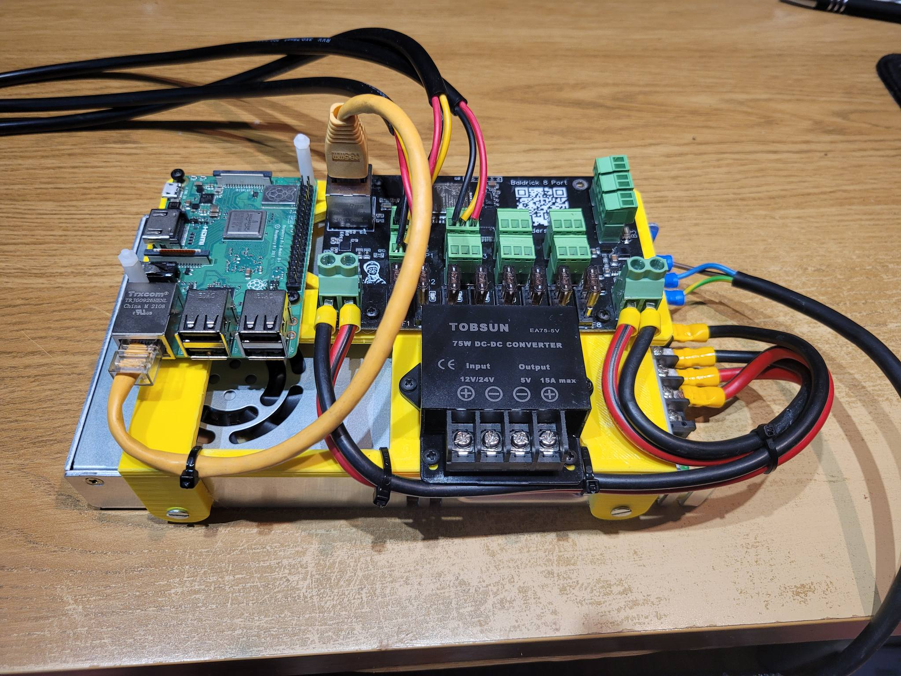
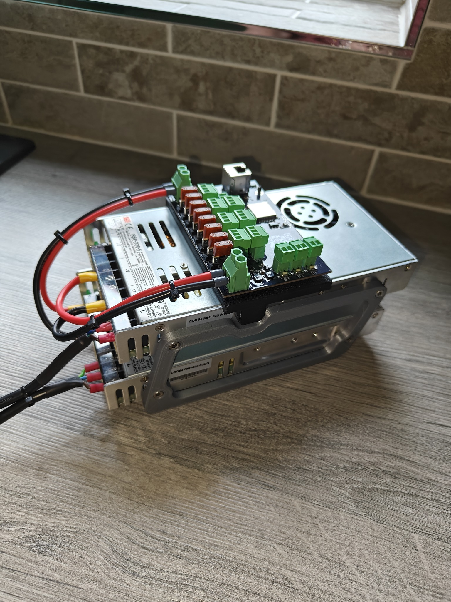

# STL's & Mounts
We designed the Baldrick footprint to be compatible with common smart receiver mounts so that customers could use a range of premade mounts on other communities 

That hasn't stopped our incredible friends and customers from building there own and with their permission, some of them are here to download

## Original Baldrick Mount - [Download](../img/stls/RSP-320-Baldrick.stl)
<b> Designed by Greg Macaree</b>

This mount has breakout clips and is designed to fit on a Meanwell RS320

## Pi + Buck Converter - [Download](../img/stls/Pi-Buck-Baldrick.stl)
<b> Designed by Stephen Parberry</b>

This mount allows the addition of a Pi and Buck Converter to the PSU.

## Double Stack Meanwell Mounts - [Download](../img/stls/Baldrick_Matt.zip)
<b> Designed by Matt Connolly</b>

Hi all,  I needed to stack 2 RSP-320's having each one power a side of the Baldrick8 so I've designed these rails with a bend in them so you can still use the standard RSP Baldrick mounting plate.  

