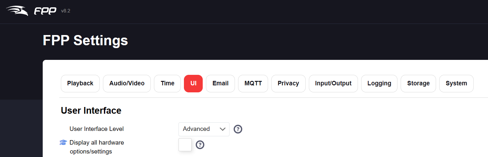
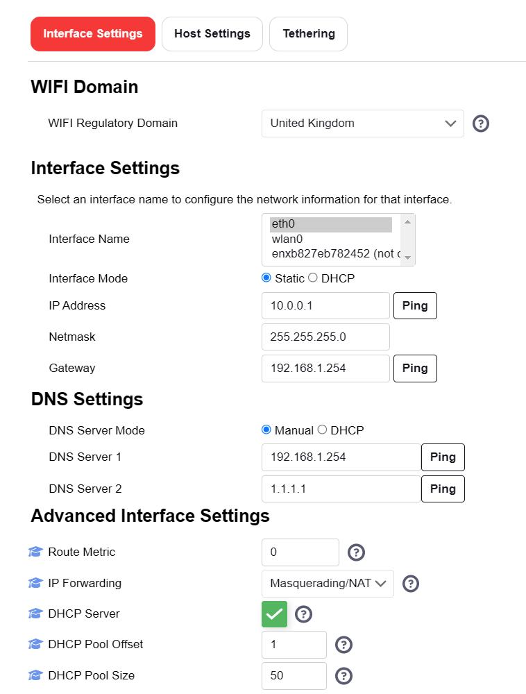
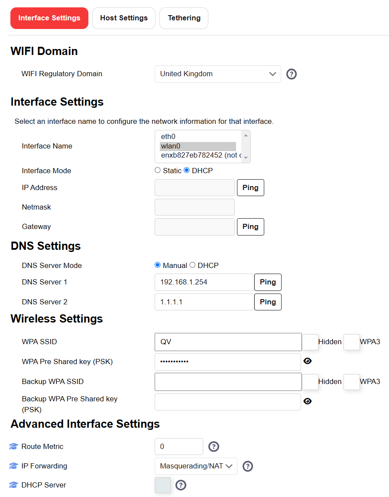
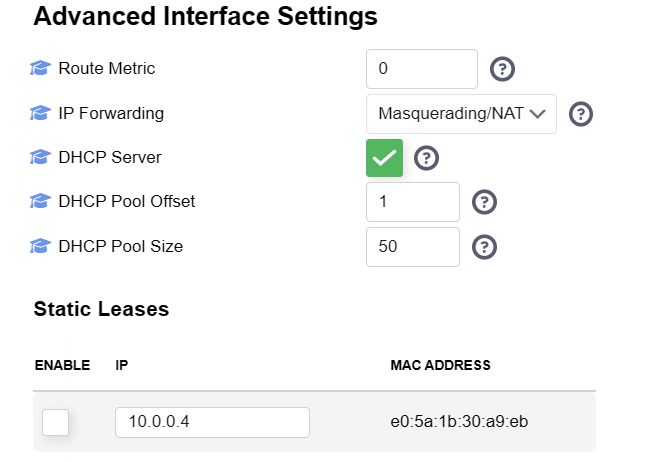
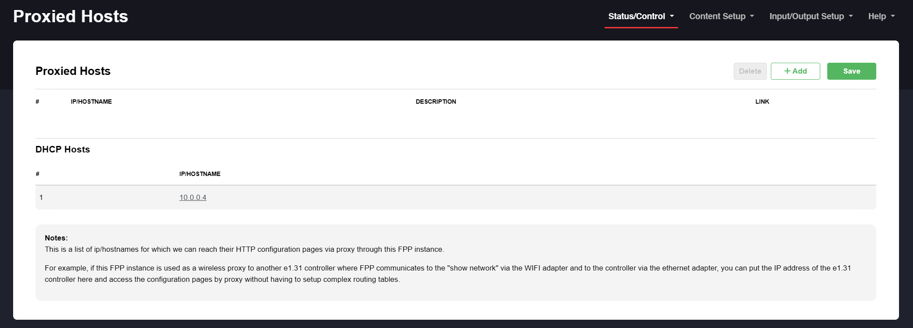
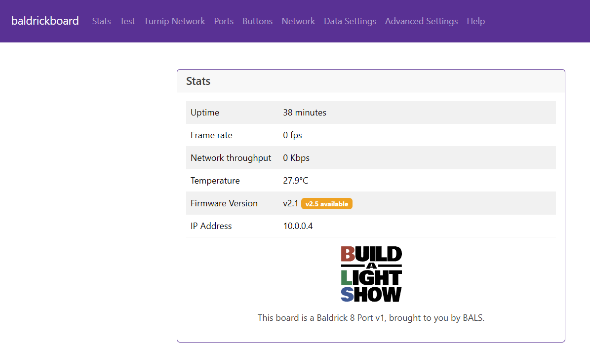

# Upgrading Baldrick via FPP Proxy

Some of you like to make things complicated and run FPP through tethering or proxy mode!

Luckily our good friend Greg Macaree has written a guide on how to still get updates during this method and we've shamelessly stolen it.

First up, we need to ensure your UI is set to advanced.

Then under Network Configuration (eth0) give it a static IP outside your regular range and setting the Gateway and DNS as your regular WiFi router.
I set IP Forwarding to Masquerading/NAT and enabled DHCP server:

and then on Network Settings (wlan0) I left it on DHCP, but ensured the DNS remained on manual with the settings as above
I set IP Forwarding as Masquerading/NAT once again.

Once completed, I save & reboot the Pi.
Having rebooted (mine didn't come back the first time and I had to power cycle it). I then plugged Baldrick into it & powered it on.

A few moments later, I checked the Network Settings / Eth0 and It has seen the Baldrick and assigned an IP address to it.
I could then check the Enable box to set a DHCP reservation (so it doesn't move IP's).

With that active, I could then go to Status/Control, Proxy Settings and under DHCP hosts was an entry for the Baldrick:

Click that link and up comes the Baldrick webpage.

That is telling me that v2.5 is available, so that shows it has internet connectivity.

Job done.   Now you can set it up in xLights, with the IP listed above (10.0.0.4 in my case) and the proxy being the Pi's Wifi IP (in my case 192.168.1.57)