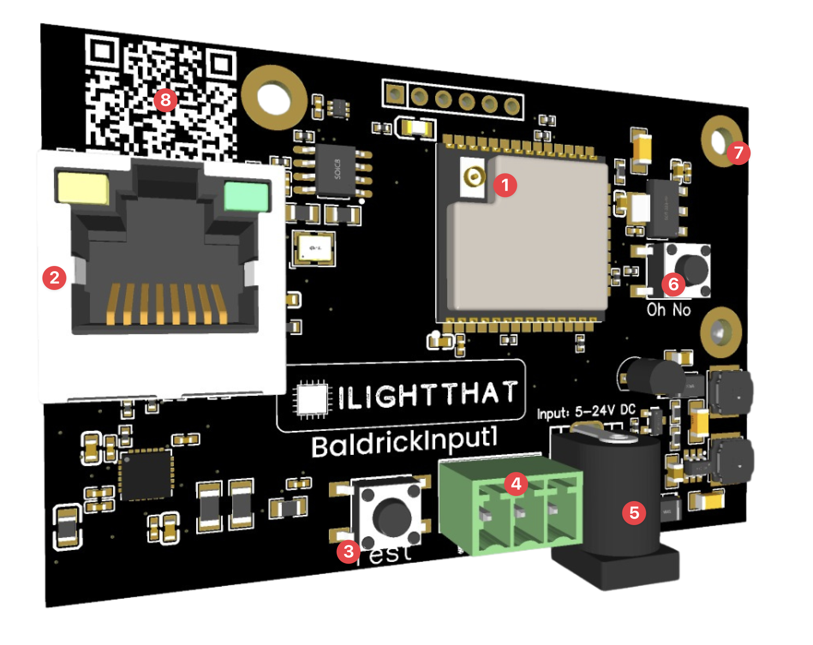

# Board Overview

1. Wireless Chip, the BaldrickInput1 can run on either Wifi or Ethernet (but to get the wifi working, you'll need an antenna)
2. 100mb Ethernet Port, you can use this to connect to your show network.
3. Test Button, use this to test what you've setup
4. *Turniput*, connect a button, motion sensor, beambreak or anything here to trigger an effect (it also has an output for lamp control)
5. Power Jack, can take 5v to 24v (each side can take different voltages) and will automatically step down to power the components, no jumpers needed. **Whatever voltage you used here is also used to power the lamp**
6. Oh No button, use this to reset the board by holding for 5 seconds when the board is booting. 
7. Mounting Holes, the BaldrickInput1 is classed as a *small* family member
8. QR Code, an easy to scan QR code which will take you to these docs for easy troubleshooting  