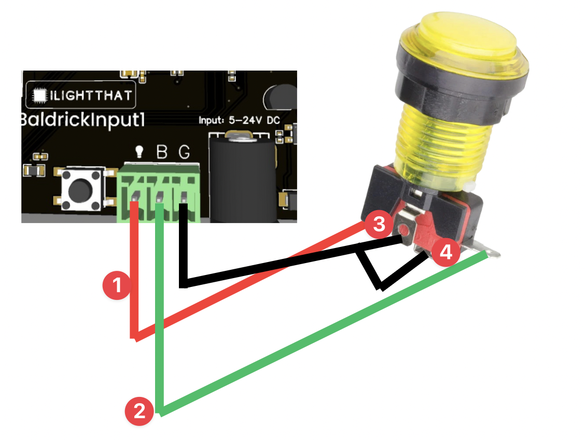

# Wire it up!

It's time to wire up the input, in this example we are going to use a button but the Input1 will work with many different types of sensors.

1) **Lamp** This should be attached to the + side of your button LED (if not using a button with an LED this can be ignored)
2) **Button** This should be attached to the switch section of the button or input
3) **Ground button** this should be attached to the ground section of the button or input
4) **Ground lamp** this should be attached to the ground section of the lamp (normally we just link the ground of the button to this)

