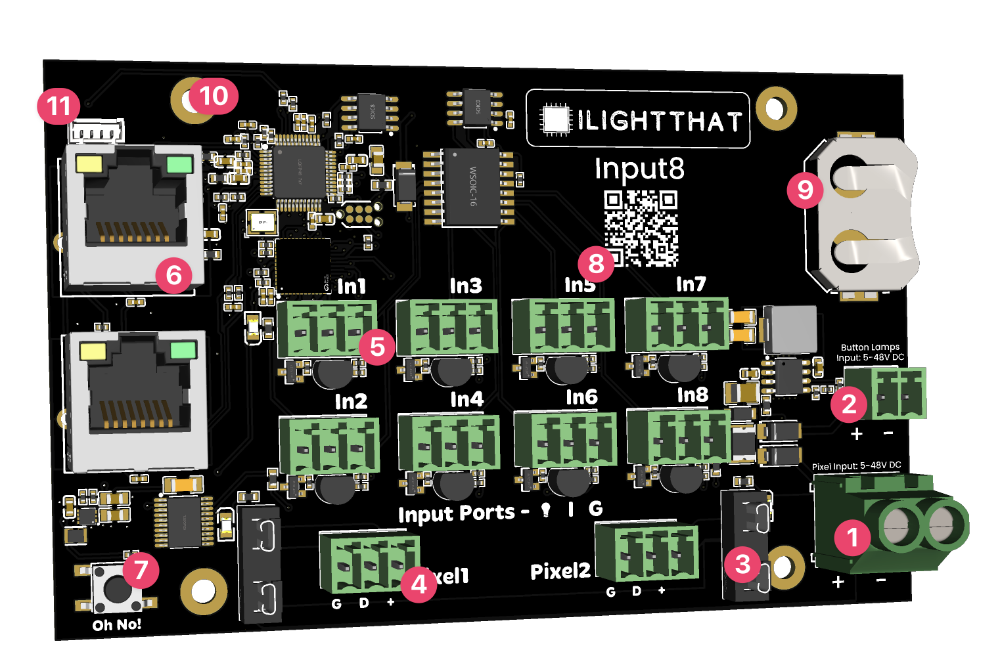

# Board Overview

1. Pixel Power Jack, can take 5v to 48v and will automatically step down to power the board.
2. Lamp Power, working on the basis that you might want 12v pixels but 5v lamps in your buttons, we've added a separate power for your lamps (if you don't use lightup buttons you can ignore this)
3. 7.5amp fuse, nothing much to say here
4. Pixel output, can output up to 750 pixels at 40FPS
5. Turniputs, our advanced input powered by the Turnip Network
6. dual 100mb Ethernet Port, you can use this to connect to your show network then daisy chain something else (like a Baldrick17 or a BaldrickSwitchy)
6. Oh No button, use this to reset the board by holding for 5 seconds when the board is booting. 
8. QR Code, an easy to scan QR code which will take you to these docs for easy troubleshooting  
9. RTC battery, keeps the time even if not connected to the internet, perfect for scheduling effects to go on and off at certain times
10. Mounting Holes, the BaldrickInput8 is classed as a *medium* family member
11. Please ignore this.