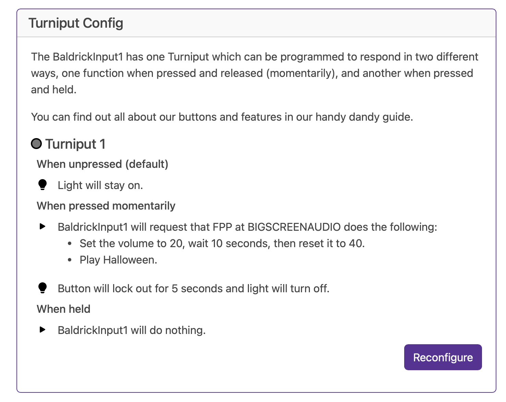

# Turniput Configuration

The BaldrickInput8 comes with eight Turniput ports to attach external triggers (buttons, beam breaks, motion sensors) that can be configured when triggered to do a multitude of tasks.

* FPP Integration
* Toggle a Baldrick Test Mode
* Change a BaldrickSwitchy output
* Change a BaldrickDMX Preset
* Call an HTTP URL
* Do Nothing

The main difference between this and the Button input on the Baldrick8 is the addition of Lamp controls 