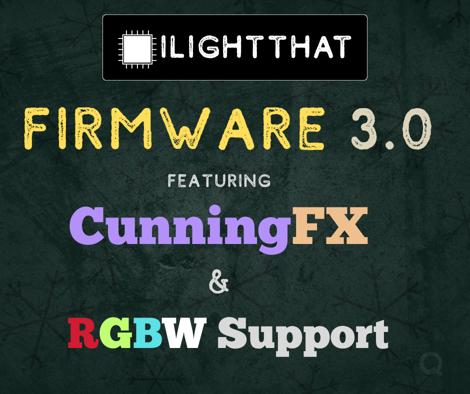
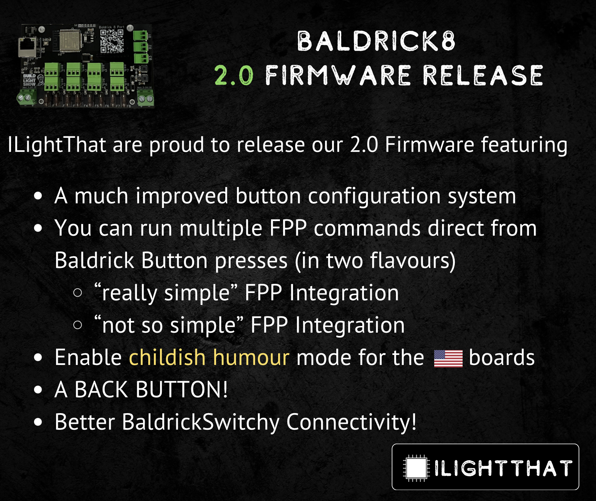

# Release Notes & Updates

## Latest Versions

Your board should alert you when a new update is available for it, not all updates are available for all boards.

* **[Baldrick8](baldrick8/introduction)** - *3.1.0*
* **[BaldrickDMX](baldrickdmx/introduction)** - *3.1.0*
* **[BaldrickSwitchy](switchy/introduction)** - *3.1.0*
* **[BaldrickInput1](input1/introduction)** -  *3.1.0*
* **[BaldrickSignals](signals/introduction)** - *0.9.2*
* **[Baldrick16](baldrick16/introduction)** - *huh?*

## Release Notes

## 3.1.0 - Proxy Shmoxy
- [Nicholas Ramsingh](https://www.facebook.com/groups/3626858730963141) reported an issue with FPP Proxy, I am in no way confirming that
there was an issue with our Firmware and we've realised that our testing Kluster doesn't actually monitor FPP proxy but I've just updated my board and it works fine for me. 

## 3.1 - Pause and Effect 
- Fixed Switchy test mode issue reported by [Luke Gunton](https://www.facebook.com/groups/ilightthat/posts/3984575505191460/)
- CunningFX will now pause when pixel data is sent to the board, reported by Jay Underdown
- Just a *slight* entire rewrite of the backend firmware to ensure that future updates and *future boards* become a lot easier to manage. 

## 3.0.1 - Just a Gregular update. 
- To celebrate the release of the [Greg Macaree Firmware 3.0 overview video](https://www.youtube.com/watch?v=u20a206EO9U) we are putting out a quick update to fix a few bugs he spotted over the last week
- We've also bought some of our own RGBW strip to add to the Kluster for testing so we should have to bug him less for 'does this work for you? in the future' thanks for your help Greg!

## 3.0

- CunningFX is our brand new visual generator for artists, architects and those folk who like to turn lights on to mark special occasions, with over 5 (wow) different effects, colour, speed selection and advanced features such as layering and model targeting, we are really excited to evolve this feature as you use it and feedback
- RGBW Support *Finally*
- CunningFX can be activated over the Turnip network so your Input1 and Baldrick8 buttons can toggle presets, simply lovely. 

## 2.7.1 - The Chupdate 
- Sometimes when feedback comes in strong, there is no choice but send out the company BALDRICKSIGNAL(S). Today that notice went out loud and clear *CHUCK NEEDS HELP*. The alarm goes off and each member of the team drops what they are doing, family dinners are interrupted, dogs are half walked and Disney+ box sets are paused as the team rushes to Whatsapp to see how they can help put out an update in time. After some furious typing, debates over code quality and **over 2 lines of code changed**! The update was finally complete.

- Test mode now defaults to Rainbow instead of ALL OFF 

## 2.7 - All Boards

- After our first season we took a look at the crash data and some of the testing results from our Kluster, you'll see a bunch of stability updates over the next few months as we add more and more load to the boards to see what the limits are. 
- We've been running 20 boards full pelt with 750 pixels per port for 40 hours at a time, this release is what we've been working on since Christmas and we are very very pleased with it! 
- ⁠Fix minor UI bug that was annoying Pete (some cards were different widths) that nobody else noticed
- Fix minor UI bug that Dom noticed a while back (JS console warnings about IP addresses not being populated)
- If the board crashes (shock) it's designed to instantly restart so you don't notice, sometimes it didn't restart so we've told it off and it's promised us it will be good.
- If the board starts to get low on memory, we reduce the turnip activities until it comes back
- We ⁠fixed a dumb problem where we can offer to control FPP instances that we can't actually contact

## 2.6 - All Boards
- The seasonal freeze is over and we've got some 'none priority' fixes and optimisations for the board ready for you
- The webserver had a crashing issue when it was loaded more than once and the RAM got low, we've tried to fix that but why do you need the UI loaded in more than one tab... at this point it's you causing the issues.
- ⁠Rework boot sequence to avoid problem bootloops that survive a b3-reset, this has been a pain in the arse for people and we do apologise, I can't even make a sarcastic comment because this one was on us but it took us a while to work out what the hell was going on with our 'bulletproof reset system'
- ⁠Kill a memory leak that occurred when network traffic got busy and the alternative of 'stop having big shows' wasn't approved. 
- ⁠Be better behaved in Artnet and E1.31/sACN code to avoid an annoying crash, again crashes are bad.
- We've shuffled a few bits around internally and have found even more RAM for your pixel pleasure, they didn't think it was possible, but it is!

## 2.5.6 - All Boards
- This fixes some freezing issues that were discoverd when using older protocols 

## 2.5 - All Boards
- We've added a new section to the web interface which indicates where streaming data is being received from, what type it is and what the size of data is. The board will also show if you data is being received from multiple IP addresses at once *(i.e. xLights & FPP or two FPP installs)*

- During the last update some people may have had to reset their board if their network was pretty fast, whilst we appreciate your dedication to good network speed, it did point out a slight error in our networking code and so we've re-written that. If you all could switch back to networking via null modem cables, that would help us out in future.

#### Seasonal Freeze
With this feature added, we now enter our 'seasonal freeze period' no other features will be added to the firmware public release until the season is over and only fixes and improvements will be done. We may test some new features out in our BETA track which you can opt-in to but if your show is live and working, **Don't mess with it**

## 2.4.3 - All Boards
- ⁠Blank LEDs on startup, as requested by Derek Jamison whose pixels start blue, so we've sent a signal to cheer them up.
- Rewritten the Turnip network discovery code, you probably won't see a difference unless you run more than 5 BaldrickBoards (You could buy more to test it out).
- ⁠Fixed the "relay threshold isn't saving" reported by Robert Milton, I was going to type something sarcastic here but it was an issue and we've fixed it.  

## 2.4.2 
- An initial fix for a board timeout issue affect some Baldrick8 boards. 

## 2.4.1
- I could make up something here like bug fixes, but the truth is we typed a .2 instead of a .1 in the release number column

## 2.4

- Fix vendor logo formatting on smaller screens, we wouldn't want you to be unable to use test mode due to a giant BUILD A LIGHT SHOW logo
- We've done some Firmware refactoring and now it looks really pretty and stylish, not that you've noticed.
- BaldrickInput1 support
- New managed update mechanism, so you don't have to upload all the boards when we do a firmware release
- Allow buttons to trigger test modes on remote boards (somebody asked, I guess?)
- Fix supposed rendering glitches, these glitches have still not officially being confirmed but if they were confirmed, they'd be fixed now.
Blank unused pixels after test modes, they had a habit of staying on.

## 2.3

- Tweaked our websockets integration to work across a few more browsers (and implemented a fallback for those people who are running weird or older browsers)
- We've redone the button interface a little, adding timeouts & pressed indicators, laying the groundwork for **[REDACTED]**
- A secret update hidden... ooOooOOo.. why would I mention this.. because I write the notes.
- Updated the sACN/ArtNet code to run better in certain situations, it's not a sexy feature but since it's the main point of the board, I thought we best mention it

## 2.2.1

- Turns out FPP Proxy didn't like our Websockets implementation, so we've worked around it (and submitted slight tweak to FPP which should make them (and other websockets) friends
- Sometimes the Baldrick8 got a bit upset when it couldn't detect the internet, we put it in the naughty corner and told it to learn to stand up on it's own 8 ports..
- Rob Milton broke the UI when editing models, I don't know why he just doesn't edit the models in xLights like everyone else but I guess we should fix it.

## 2.2

- BaldrickDMX added to button options, PLEASE DO NOT MAKE A FLAME CANNON GO OFF AT THE TOUCH OF A BALDRICK8 BUTTON.. JUST BECAUSE YOU CAN DOESN'T MEAN YOU SHOULD
- Websockets in UI - Faster, more responsive UI that uses less controller resource, plus it's a fun word to say... Websockets..
- Crashdumps - the board will now send us a small error log when you break it... because as we all know snitches use switches.

## 2.1

- Rewritten the netcode, improved stability and speed
- Added the MOST requested feature to the Baldrick UI... A reboot board button.
- Test Sync will now lock out the other boards and point you to the main board for modification

## 2.0

After months of tweaking and testing, it's time for our 2.0 firmware release! 

- We've completely redesigned the way you configure buttons and added more functionality
- You can now quickly and easily control FPP direct from a Baldrick8 button press
    - With Easy Mode, we've extracted two of the most popular commands (Play something and change the volume) and made the simple do ([you can have your button playing Barbie Girl on repeat in less than 30 settings](vid/barbie-girl.mp4))
    - With Advanced Mode, you get full access to the FPP API and related commands and you can play with them till your hearts content.
- Improved BaldrickSwitchy connectivity

We really are proud of this update and are looking forward to hearing how everyone gets on with it.

## 1.28
- We now have an advanced settings dialog... OOoooOOOo. The first advanced setting is the ability to opt-in to beta releases, which are features we've tested but they could do with a few more eyes. You can find out more about it by joining our [Baldrick Beta Facebook Group](https://www.facebook.com/groups/baldrickbetatesters)

## 1.27
- Introduction of BaldrickSwitchy to the Turnip Network, allowing you to control BaldrickSwitchy ports from the buttons on your Baldrick8 

## 1.26.1
- A small release to handle people with multiple Baldrick Boards or as we call them in the office our favourite people 
- We fixed a bug that nobody discovered and whilst most release notes wouldn't even mention but we do because we care.

## 1.26
- ⁠Added new button config GUI with more exciting options for what buttons can do, let's just call this the base update ;)
- Initial fix for issues with sACN/ArtNet from Enttec LED Mapper, Can you believe some people DON'T want to use xLights
- ⁠Added support for the [REDACTED] board, soon™
- ⁠Corrected speeling error in UI, Sorry.
- ⁠Added ILT vendor branding, can you believe we forgot out own logo?

## 1.25
- Added the 'I broke the network mode' inspired from a suggestion by Alan Hanson (look at that two mentions in two updates). When booting the board, if you press and hold button 1, it will reset all the network settings, go back to DHCP and completely forget that you tried to set a static IP address and got the gateway DNS wrong. 

## 1.21.4
- Tweaked the RAINBOWS MODE, it was a bit slow for my liking so it got changed... no the power hasn't totally gone to my head
- Fixed a Grammar issue which I'm shocked Alan Hanson didn't see 
- Added logos for additional vendors (more countries to Buy the Baldrick8 in)
- Pixels now start at 1 rather than 0.. causing developers worldwide to cringe but that appears to be the way "It's done"
- When adding a model, the default test colour will now one of several preselected colours rather than just red, is this a laying the groundwork for a new feature coming soon.. who knows.. well, I do but I'm not telling you.
- The board connects to our update server periodically to check for updates, if it cannot do this, we let you know there may be an issue with your network settings. We will never admit that the problem could be on our side.

## 1.21.3
- During testing for a very soon to be released feature, we noticed that in certain circumstances sending data via DDP looked a bit wonky.  So we've pushed this before anyone really notices.

## 1.21.2
- We've had a report of one Baldrick customer having an off by one pixel issue in some circumstances. Obviously, we had a decision to make; Do we get rid of the customer or do we get rid of the error.  This is an update pushed so it looks like we fixed the error #plausibledeniability. 

## 1.21.1
- Preparations for our traitorous cousins receiving their Baldrick8 Boards.

## 1.21
- Added vendor mode (oooOooOOoOoOo)
- ⁠Friend scanning - Baldrick will now look for other Baldricks on the network and let you know how they are doing, you can also syncronise your test mode with them.
- Board safety and reliability - Factory reset can now recover from entirely broken firmware, not just broken settings, some of our testers did their job well.. and we want to make sure they can't do it again. 
- ⁠Improved web UI - Faster loading, moved some parts around, definitely not a few hours spent bikeshedding.

## 1.20
- ⁠Fixes to DDP parser to cope better with packet loss, etc.
- Linking to the brand newBaldrick User Group
- ⁠Add multicast sACN
- Additions to Artnet / E1.31 compatibility
- Updating HTTP server to mitigate network packet loss affecting the lights output

## v1.19
- ⁠ArtNet support, If you don't know what this means then don't worry about it
- ⁠Unicast E1.31/sACN support, so stop asking!
- ⁠Colour pick test mode enabled, you can now make ALL pixels a single colour using a colour picker (works better in Chrome and Firefox that Safari.. sorry Mac fans but we are working on it)

## v1.18
- We've added model colour mode which allows you to have a colour per model, as suggested by Ron Howard

## v1.17
- With the official release of xLights integration we had to do a few changes to make it work on our side... Update xLights and enjoy!

## v1.16.3
- Some fixes to the UI around network settings (apparently SOME people wanted to be able to cancel)
- Removed the blank frame between test modes if we don't need it (Looks a bit crap with it.)
- Sped up the HTTP responses on button press (don't act like you know what that means)

## v1.16.2
- Added the base code for some secret unannounced, coming soon feature. 

## v1.16.1
- turns out if you switch test mode again and again and again and again and again and again and again and again and again and again there is a SLIGHT memory leak which slows stuff down, gee thanks 'tester' for letting us know about that.

## v1.16
- ⁠Test mode panel redesigned
- ⁠⁠Implemented Hodgical mode
- ⁠⁠Added Red mode
- ⁠⁠The ability to select your brightness
- ⁠⁠Fixed a few bugs that none of you noticed.

## BOOTLOADER v1.3
- We've updated the bootloader, PLEASE DO NOT TURN OFF THE POWER WHEN YOU UPDATE THIS (if you can schedule your unexpected power cut till AFTER this update, that would be great)

## v1.15.3
- Turns out there was a little bit more JUICE to squeeze in optimisation and we've managed to get a bit more performance out of the board 

## v1.15.2
- We didn't like .1 

## v1.15.1
- Look, stop being so nosy, sometimes we just like to increment a number

## v1.15
- Add colour order options to the pixels - Model options will be available in future xLights releases, hold your horses.
- ⁠Add button support, we've also written a nice guide on what to do with the bloody things
- ⁠Allow bootloader updates, correct factory reset problems, not that any of you noticed...
- ⁠Add release channels for future software testing, but that's for the grown ups.
- ⁠Efficieny updates - pixels should be more responsive, switched CPR method.
- ⁠Updates to the web interface caching - Should be harder to make the lights glitch by hammering reload (but WHY DO YOU KEEP DOING THAT)

## v1.14
- ⁠Better, more helpful validation of form input, some of you just wouldn't leave it alone!
- ⁠Better support for pre-release testing, what does this mean? we'll never tell. 
- Fix for FPP proxy header issue, Thanks Adam!

## v1.13
- Nunya Business, this was in no way an emergency release to fix a bug introduced in 1.12

## v1.12
- ⁠Input validation, both client and serverside, to stop you cheekly little scamps from setting 6000% brightness and starting pixel channel -100
- ⁠Prevent crash when rapidly cycling test mode, the board got a little excited so we've given it a peppermint tea and told it to calm down. 
- ⁠Move jquery/bootstrap to device-hosted, for closed networks, SOME people want to use this board in a place WITHOUT internet.. can you imagine? 
- ⁠Network config - Static IP and device hostname now configurable, so STOP COMPLAINING! 
- ⁠Fixed links in footer to open in new window, because you promised us you'd never leave.

## v1.11 
- ⁠Turn off pixels when exiting test mode
- ⁠Fixed problems saving channel start 
- ⁠DDP start channels are now 1-based as in xLights, FPP, etc.
- ⁠Requires update to xLights (Built 28-03-24)

## v1.10
- ⁠Rename "Everything off" test mode (Thanks Rob Milton)
- ⁠Allow B1 to disable test mode with long press (Thanks Kevin Barker)

## v1.9

- Fix dumb DDP parse bug which would leave gaps in px output
- ⁠Adapt version checks slightly
- ⁠Fix up links on Web UI

## v1.8
- Fixed an issue if you pushed from xLights without first uploading the firmware

## v1.7
- ⁠Fix issue with config uploads and large configs
- ⁠Add periodic version check. Now every 10 minutes, rather than once at boot

## v1.6 
- ⁠Stop UI state table twitchily resizing
- ⁠Make the test "Apply to" thing more clear for the moment
- ⁠Mark some UI fields as numbers
- ⁠Refresh system settings on UI when changed

## v1.5
- ⁠ Rewrite test mode handling, add new test modes
- ⁠Add button handler - Press B1 for 5 seconds to activate rainbows on all configured props

## v1.4
- ⁠Move to component for OTA, share with factory firmware
- ⁠Secure firmware releases

## v1.3
- ⁠Fix stupid build issue

## v1.2
- ⁠Fix UI weirdness if version check hasn't completed

## v1.1 
- ⁠Add factory reset - Hold B3 for 5 seconds and power cycle
- Ruin Dom's hard work on the interface and replace with a bootstrap interface

## v1.0
- ⁠Add flash encryption to SDK Config
- ⁠Fix CI config for SDK
- First real release :)