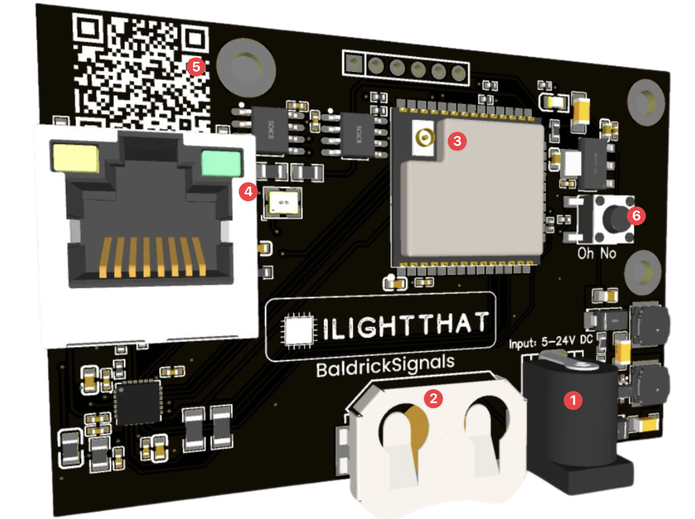

# Board Overview

1. Power Jack, can take 5v to 24v (each side can take different voltages) and will automatically step down to power the components, no jumpers needed. **Whatever voltage you used here is also used to power the lamp**
2. CR2032 Coin cell clip, using this will allow the BaldrickSignals to keep the time even when the board is disconnected from the network (this will not power the board). Your vendor will probably not supply this so make sure you've got one.
3. Wireless Chip, the BaldrickSignals uses wifi to detect other devices, you'll need an [antenna](../common-questions/antennas))
4. 100mb Ethernet Port, you can use this to connect to your show network.
5. QR Code, an easy to scan QR code which will take you to these docs for easy troubleshooting  
6. Oh No button, use this to reset the board by holding for 5 seconds when the board is booting. 