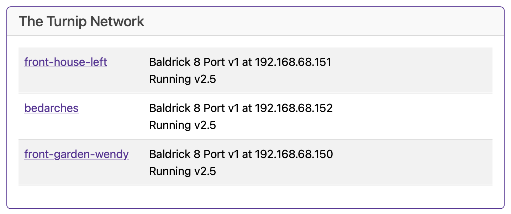

# The Turnip Network

The Baldrick Boards will keep an eye out on the network for other Baldricks and let you know how they are doing (this is helpful as we don't put an LCD screen on the board).

You can directly jump to their control panel from this interface and when they appear in this list, more board functionality will become available.

