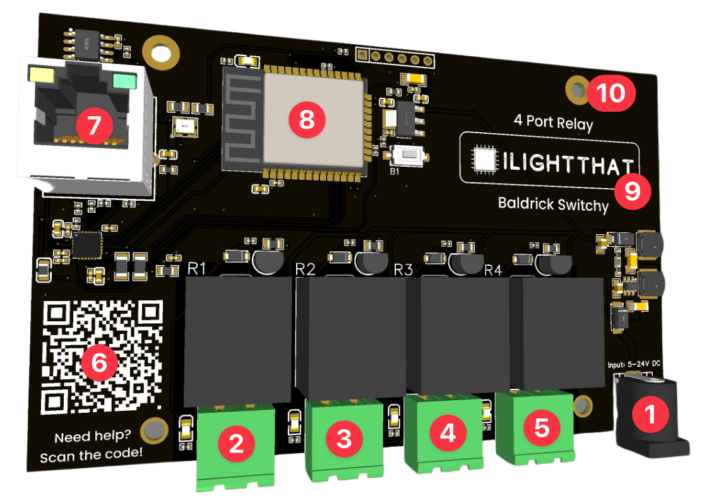

# Board Overview

1. Power Jack, you can put 5v-24v through a barrel connector (centre positive) and we use 5.5x2.1mm barrel jacks. Please remember you are just powering the board not the devices.
2. This is relay 1. Connect your device to to enable control via the BaldrickSwitchy.
3. This is relay 2. Connect your device to to enable control via the BaldrickSwitchy.
4. This is relay 3. Connect your device to to enable control via the BaldrickSwitchy.
5. This is relay 4. Connect your device to to enable control via the BaldrickSwitchy.
6. QR Code, an easy to scan QR code which will take you to these docs for quick troubleshooting.
7. Ethernet port, to ensure the consistent connection to your devices, we've added a 100mb ethernet port to connect to your show network.
8. ESP32, the brains of our board, don't worry about this too much, that's our job, not yours.
9. Our company logo, isn't it great?.
10. Mounting Holes, we've designed the BaldrickSwitchy to not only be as compact as possible, we've matched the mounting holes to other common controllers so mounts can be reused (in this case the Falcon SRX2 Receiver). **DO NOT DRILL out** these holes to make them fit the screws you've got already, doing this will void any warranty. 

The board will also come affixed to a [Darwin Tray](common-questions/what_is_the_tray.md) for your protection.