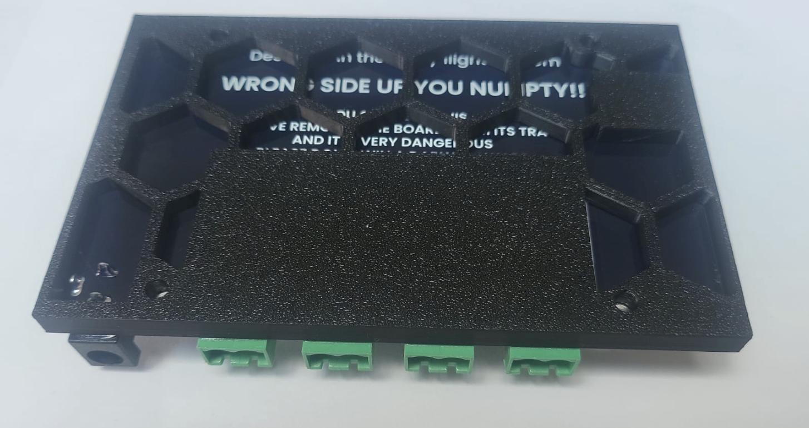

# What is this tray?

The BaldrickSwitchy has been designed to be as flexible as possible with regards to the types of things it can power which means that you can even put mains electricity through the relay connectors **(NOT THE BARREL CONNECTOR)**, which if touched could cause [issues](https://youtu.be/6H5pct0kgD8?si=UTWwq2YwtB9fD38d&t=6).

Every BaldrickSwitchy sold comes with a **DarwinTray** to help protect you from accidentally winning a [Darwin award](https://darwinawards.com/). 

The DarwinTray reduces the risk (but doesn't guarantee!) of you making from any contact with anything that could be live whilst still making it easy to mount to your box.
