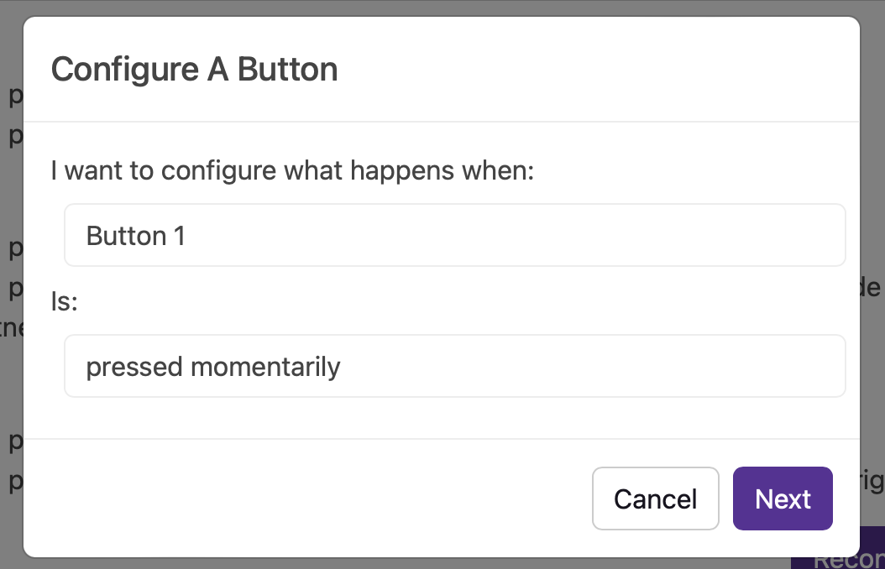
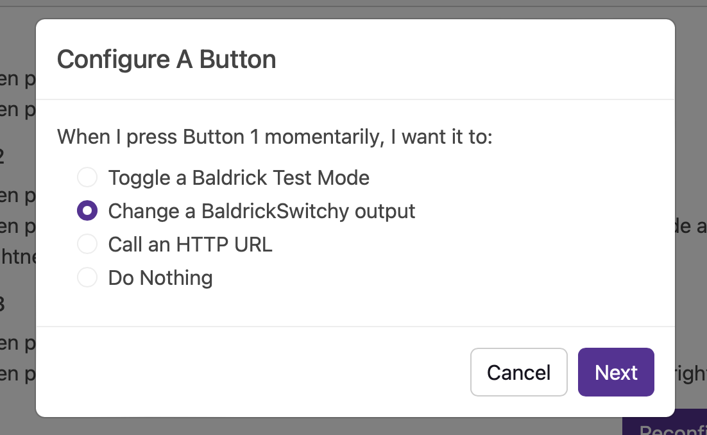
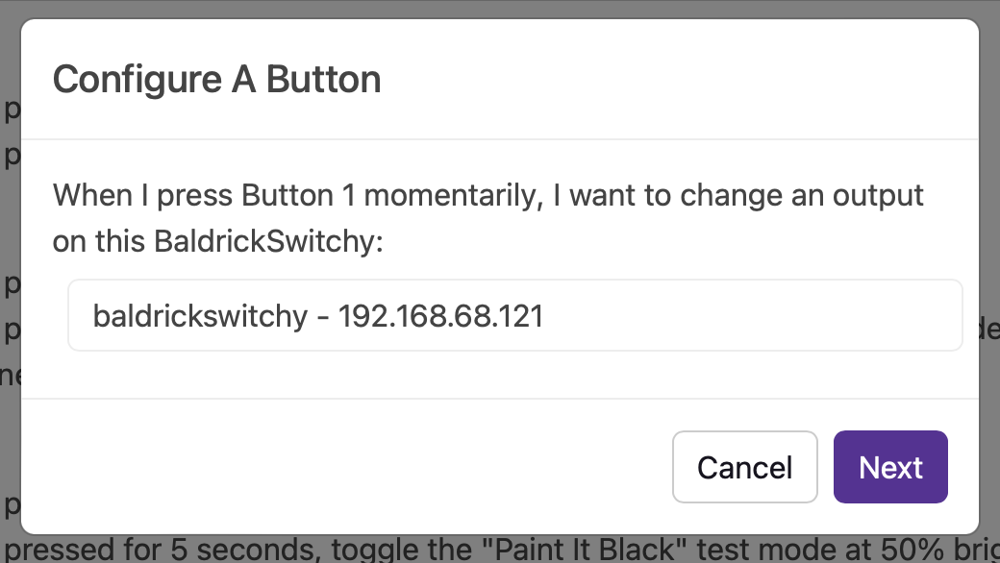
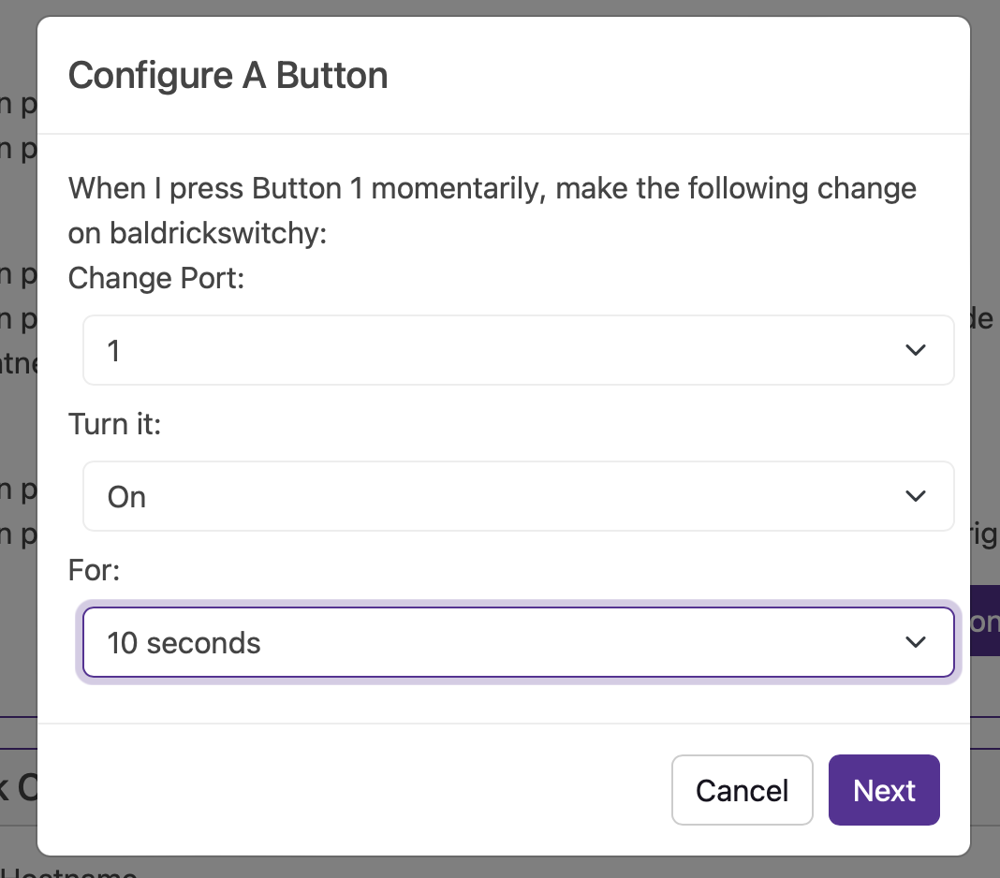
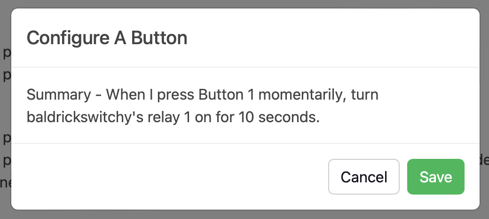

# Control From Baldrick8

One of the powers of the Baldrick family comes from what we call the *Turnip Network* and one of the first uses of this is how easy it is to use the buttons on your Baldrick8 board to control a Baldrick Switchy.

If we head over to the Baldrick8 Button config and click 'Configure a button'

We can choose which button we want the BaldrickSwitchy to respond to and if it should be instant or the button should be held for 5 seconds

We want to select Change a BaldrickSwitchy output.

The box will load with all the BaldrickSwitchy devices found on the network (Yes it can handle multiple!)

Now comes the most complicated bit, which relay port would you like to modify and for how long, see that wasn't so bad was it. 

Just a last bit of confirmation before the button goes active, at some point we should put a test button in at this stage shouldn't we? 

