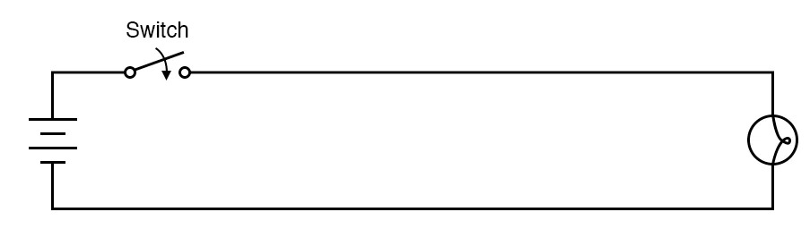
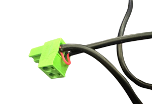
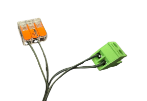

# Connecting Devices

The BaldrickySwitchy is pretty much exactly as it says in its name - It is a switch (or a set of switches!). It doesn't provide power, it doesn't change voltages, it doesn't dim - It switches. 

*A Switch makes or breaks a circuit, as seen in this picture:*

So with this in mind, it would be impossible for us to list all the ways that you can connect devices but a very simple way of quickly integrating the BaldrickSwitchy is 

You can take a wire, cut it, and put each side of the cut wire into one of connectors then use BaldrickSwitchy to make the wire complete again when it is activated (BaldrickSwitchy leaves the circuit open/broken at rest, and closes/makes the circuit when activated). 

That wire you cut could be;
* A live wire in a cable feeding a string of mains powered lights
* The power wire going into a "dumb" snow/smoke/bubble machine
* A 0v signal or control wire on a device that has a "button to activate"

Here are two example images of integration of the Relay connector one with a USB powered device and the negaive line cut

One with a mains powered device and both lines cut and the live connected via a WAGO

If you are planning to connect something powerful like a snowmachine, make sure that it will not draw more than **8amps of power** (at 240v, that is about 2000w, or at 100v for the US folk, it is about 800w), as the relays on baldrick may get hot, melt or get stuck closed if you pull too much current (thats bad news!).

It's time to connect a device, now I don't need to say it but I will..

**BE CAREFUL, DO NOT DO ANY OF THIS WITH ANYTHING PLUGGED IN AND DO NOT REMOVE THE DARWINTRAY**