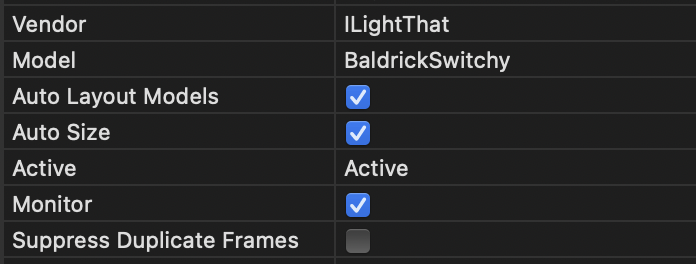
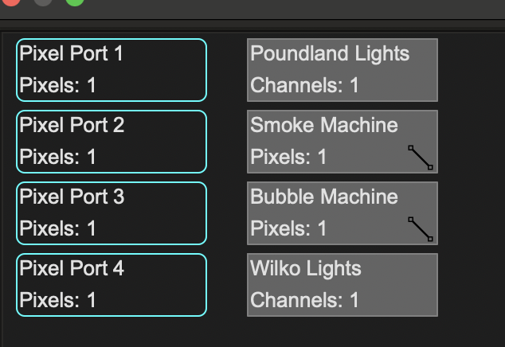
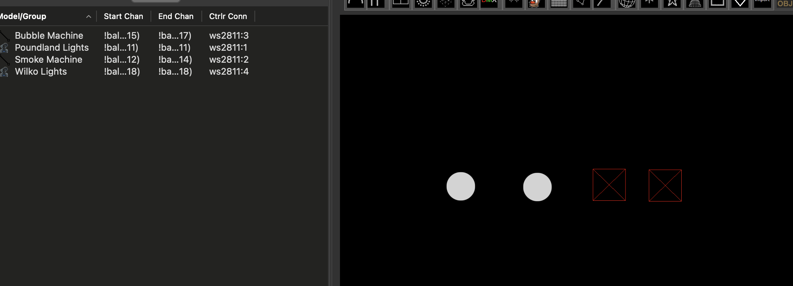
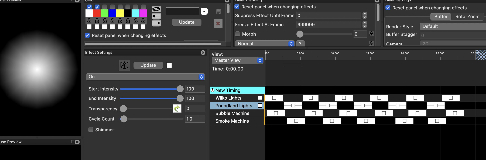

# xLights Setup

### Automatic Detection
You can connect directly with xLights, look for BaldrickSwitchy under ILightThat

From here you can push your model settings directly to the controller and output to lights nice and easily! 

### Manual Addition

You can either;
* Click **Discover** and xLights will automagically find the BaldrickSwitchy.
* Add the board manually by selecting *ILightThat* as a vendor and *BaldrickSwitchy* as the Model. You will then need to put the IP Address in manually

## xLights Visualizer

The BaldrickSwitchy will have four ports in xLights, surprisingly each one correlates to a relay on the board.

## Layout Settings

There are two simple ways to add a device to xLights in the layout, you can either add it as a single pixel or a single channel DMX Prop (we recommend DMX over Pixel to avoid confusion later on)

## Sequencing BaldrickSwitchy

Sequencing BaldrickSwitchy couldn't be easier, you just turn it on! Oh sure there are fancy things you can do by having it on and off in sequence but at the very basic level, turn it on then [turn it off](https://www.youtube.com/watch?v=5KSBEChzpMM).

