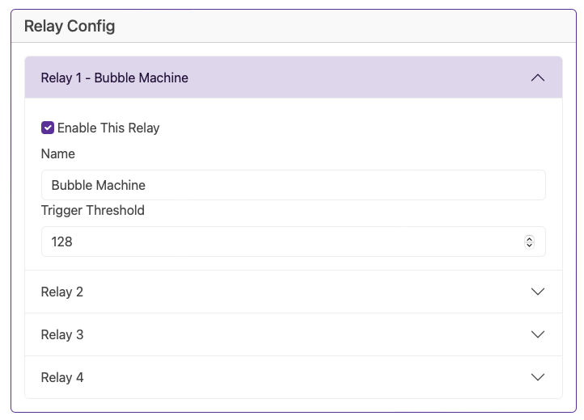

# Relay Configuration

Whilst we expect much of the configuration to be pushed from xLights, you can directly add your devices to the BaldrickSwitchy from this section.

It's a simple interface with only a name and a trigger threshold.