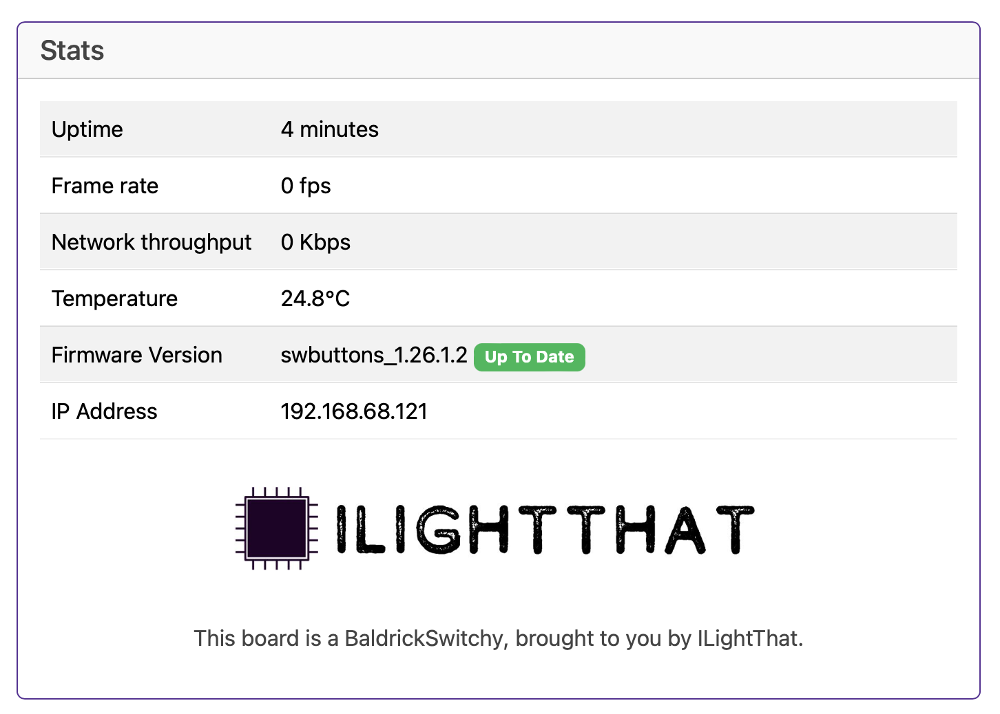

# Stats

The Stats board gives you a heads up as to what's going on with your controller

#### Uptime 
Tells you how long your controller has been powered on *(this is useful in June to remind you that you forgot to turn it off over christmas)*

#### Frame Rate 
This lets you know what FPS (Frames Per Second) the controller is currently outputting *(Why would I need this for a relay board you may ask, and we will let you keep guessing)*

#### Network Throughput 
Like the FPS, this gives you an indication of the volume of network traffic passing through the controller, this should help with debugging

#### Temperature 
With a sensor next to the Ethernet connector, this gives you an indication of the board temperature *(in Celsius) because water freezes at 0, not 32.. how does that make sense?*

Generally, PCBs and components are good for -40 to +85°C, Anything below 60°C on this board is fine and nothing to worry about. If the temp is above that, try blowing on it like you would a hot chip out of the oven. 

#### Firmware Version 
Let's you know what version firmware your BaldrickSwitchy is currently running 

*(clicking the new version will upgrade it in place then restart the controller)*

#### IP Address 
Tells you the current IP address of the Baldrick Switchy