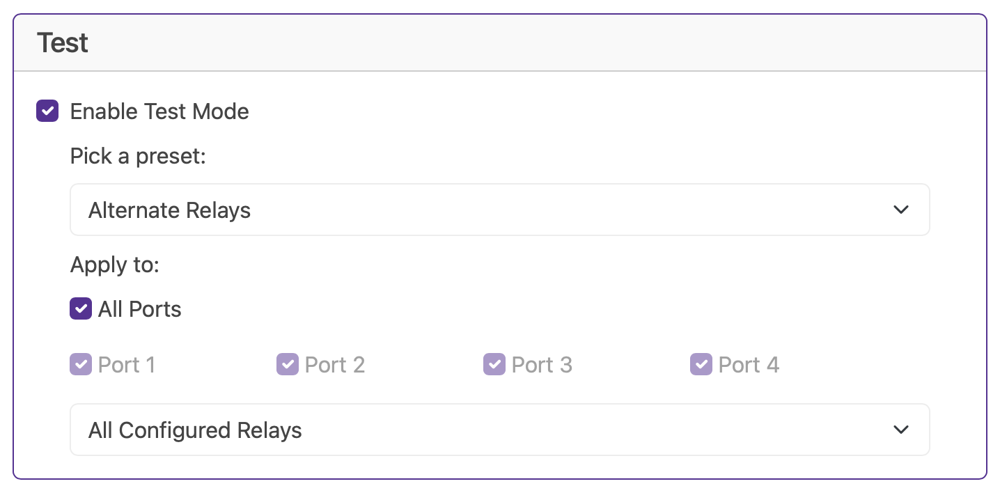

# Test Mode

Test mode is one of the most important features of the Baldrick Board, if it's two hours before switch on and something is going wrong, YOU NEED CLEAR INFORMATION QUICKLY..

Let's break these down 

### Presets

At the moment we only have one preset, **Alternate Relay** which alternates between on and off every second, but you can see we've made that Presets box into a dropdown as we know we'll think of some later. 

### Apply to

Select your port (or all ports) you'd like the effect applied to